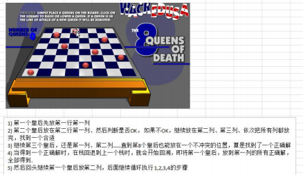

## 7.递归

**递归应用场景**

- 各种数学问题如: 8 皇后问题 , 汉诺塔, 阶乘问题, 迷宫问题, 球和篮子的问题(google 编程大赛) 
- 各种算法中也会使用到递归，比如快排，归并排序，二分查找，分治算法等. 
- 将用栈解决的问题-->第归代码比较简洁

**递归遵守的重要规则**

- 执行一个方法时，就创建一个新的受保护的独立空间(栈空间)
- 方法的局部变量是独立的，不会相互影响, 比如 n 变量
- 如果方法中使用的是引用类型变量(比如数组)，就会共享该引用类型的数据.
- 递归必须向退出递归的条件逼近，否则就是无限递归,出现 StackOverflowError，死龟了:)
- 当一个方法执行完毕，或者遇到 return，就会返回，遵守谁调用，就将结果返回给谁，同时当方法执行完毕或 者返回时，该方法也就执行完毕

### 7.1迷宫问题

使用**递归回溯**来给小球找路 

1. map 表示地图 
2. i,j 表示从地图的哪个位置开始出发 (1,1)
3. 如果小球能到 map[6][5] 位置，则说明通路找到.
4. 约定： 当 map[i][j] 为 0 表示该点没有走过 当为1 表示墙 ；2 表示通路可以走 ；3 表示该点已经走过，但是走不通 
5. 在走迷宫时，需要确定一个策略(方法) 下->右->上->左 , 如果该点走不通，再回溯

```java
/**
 * @param map 表示地图
 * @param i 从哪个位置开始找
 * @param j
 * @return 如果找到通路，就返回 true, 否则返回 false
 */
public static boolean setWay(int[][] map, int i,int j){
    if (map[6][5]==2)   return true;
    if (map[i][j]==0){
        map[i][j]=2;    //假定该点可以走通
        if (setWay(map,i+1,j)) return true;
        else if (setWay(map, i, j+1)) return true;
        else if (setWay(map, i-1, j)) return true;
        else if (setWay(map, i, j-1)) return true;
        else {
            map[i][j]=3;
            return false;
        }
    }else return false;
}
```

### 7.2八皇后问题

- 八皇后问题，是一个古老而著名的问题，是回溯算法的典型案例。该问题是国际西洋棋棋手马克斯·贝瑟尔于 1848 年提出：在 8×8 格的国际象棋上摆放八个皇后，使其不能互相攻击，即：任意两个皇后都不能处于同一行、 同一列或同一斜线上，问有多少种摆法(92)。



```java
	//定义一个 max 表示共有多少个皇后
    int max = 8;
    //定义数组 array, 保存皇后放置位置的结果,比如 arr = {0 , 4, 7, 5, 2, 6, 1, 3}
    int[] arr = new int[max];
//防入第n个皇后
public void check(int n){
    if (n==max) {
        System.out.println(Arrays.toString(arr));
        return;
    }
    //依次放入皇后
    for (int i=0;i<max;i++){
        arr[n]=i;
        if (judge(n)) {//当判断当前皇后与前面的不冲突时，递归到下一层中，开始放下一个皇后
            arr[n]=i;
            check(n+1);
        }
        //当这一层的八个位置放皇后都冲突时，回溯到上一层的for循环中，移动上一个皇后
    }
}
//判断第n个皇后摆放的位置与前面的是否冲突，冲突返回false，不冲突返回true
public boolean judge(int n){
    for (int i=0;i<n;i++){
        //判断与之前的皇后是否冲突
        //Math.abs(n-i)==Math.abs(arr[n]-arr[i])
        //当y-y = x-x时说明为等腰三角形，在同一斜线上
        if (arr[n]==arr[i]||Math.abs(n-i)==Math.abs(arr[n]-arr[i])) 
            return false;
    }
    return true;
}
```

