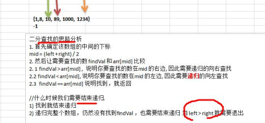
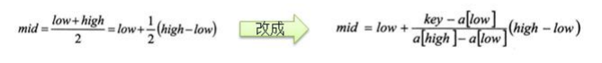
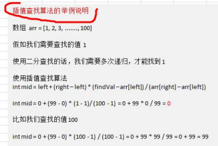
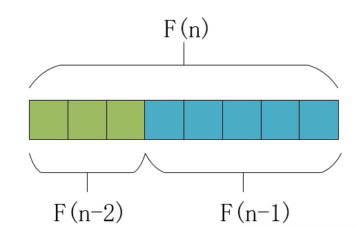
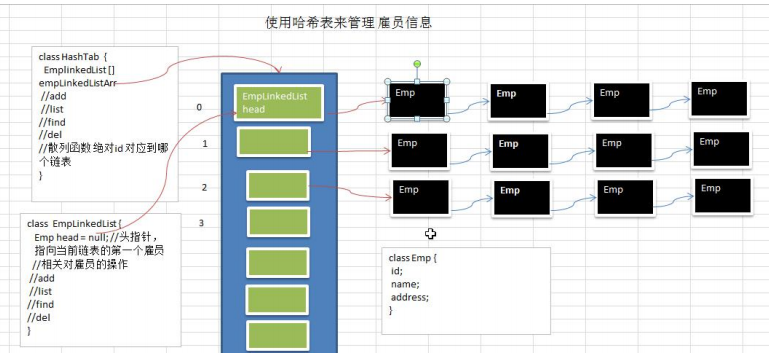

## 9.查找算法

### 9.1二分查找



```java
public static int binarySearch(int[] arr, int left, int right, int findVal){
    if (left>right) return -1;
    int mid = (left+right)/2;
    if (findVal>arr[mid])   return binarySearch(arr, mid+1, right, findVal);
    else if (findVal<arr[mid]) return binarySearch(arr, left, mid-1, findVal);
    else return mid;
}
//while循环完成的二分查找
//int mid = left + (right - left) /2;可以防止left+right超出int的范围
//(left+right)>>1==(left+right>>1)/2,但前者比后者运算更快
public static int binarySearchByWhile(int[] arr, int findVal){
    int left=0,right=arr.length-1;
    while (left<= right){
        int mid =(left+right)>>1;
        if (findVal>arr[mid])   left = mid+1;
        else if (findVal<arr[mid])  right = mid-1;
        else return mid;
    }
    return -1;
}
```

### 9.2插值查找

- 插值查找原理介绍: 插值查找算法类似于二分查找，不同的是插值查找每次从自适应 mid 处开始查找。

- 将折半查找中的求 mid 索引的公式 , low 表示左边索引 left, high 表示右边索引 right. key 就是前面我们讲的 findVal 

  

  - int mid = low + (high - low) * (key - arr[low]) / (arr[high] - arr[low]) ;/*插值索引*/ 

  - 对应前面的代码公式： 
  - int mid = left + (right – left) * (findVal – arr[left]) / (arr[right] – arr[left



```java
public static int insertValueSearch(int[] arr,int left,int right,int findVal){

    //防止当查找一个特别大的数时数组越界
    if (left>right||findVal>arr[arr.length-1]||findVal<arr[0]) return -1;
    int mid = left + ((findVal-arr[left])/(arr[right]-arr[left]))*(right-left);;
    System.out.println(mid);
    if (findVal>arr[mid])  return insertValueSearch(arr, mid+1, right, findVal);
    else if (findVal<arr[mid]) return insertValueSearch(arr, left, mid-1, findVal);
    else return mid;
}
```

### 9.3斐波那契查找

**将一个长度为F(n)数组看做前后两半，前面一半长度是F(n-1)，后面一半的长度是F(n-1)**。正是这个想法将斐波那契数列和数组联系到一起，也是后面分析的基础：



其中n的取值是任意长度的，即**对任意长度的数组都能找到对应的斐波那契数**，下面将具体介绍斐波那契查找的步骤。

斐波那契查找的整个过程可以分为：

- 构建斐波那契数列；
- 计算数组长度对应的斐波那契数列元素个数；
- 对数组进行填充；
- 循环进行区间分割，查找中间值；
- 判断中间值和目标值的关系，确定更新策略；

***1.1 构建斐波那契数列\***

这一步骤见前面的文章，构建斐波那契数列如下：

```cpp
[0, 1, 1, 2, 3, 5, 8, 13, 21, 34, 55, 89, 144, 233, 377]
```


***1.2 计算数组长度对应的斐波那契数列元素个数\***

假设手中的数据如下：

```cpp
[1, 2, 4, 6, 7, 9, 13,
 16, 17, 21, 23, 25, 27, 
 31, 45, 56, 58, 61, 65, 
 67, 73, 75, 88, 93, 102]
```

可知上述数据共25个元素，不对应1.1节中的斐波那契数列中任何F(n)，这种情况是很常见的。此时，策略是**采用“大于数组长度的最近一个斐波那契数值”**。比如当前数组长度为25，斐波那契数列中大于25的最近元素为34。


***1.3 对数组进行填充\***

确定了斐波那契数值后，就要进行数值填充，即**将数组从25个元素填充到34个**。填充时，将第26到34个元素均采用第25个元素值进行填充，即最大值填充。


***1.4 循环进行区间分割，查找中间值\***

这一个步骤与前面介绍的二分查找和插值查找相似，都是不断的缩小搜索区间，进而确定目标值的位置。区间分割公式如“要点”所述，每次分割中间位置的计算如下：


此时**数组被分割为左右两个区间，左边区间含有F(n-1)个元素**，-1是因为下标从0开始（比如F(1)表示两个元素）。


***1.5 判断中间值和目标值的关系，确定更新策略\***

中间值和目标值有三种大小关系，分别对应三种处理方式：

- 相等，则查找成功，返回中间位置即可；
- 中间值小于目标值，则说明目标值位于中间值到右边界之间（即右区间），右区间含有F(n-2)个元素，所以n应该更新为n=n-2；
- 中间值大于目标值，这说明目标值位于左边界和中间值之间（即左区间），左区间含有F(n-1)个元素，所以n应更新为n=n-1；

> [斐波那契查找原理——附python和C++实现 - 知乎 (zhihu.com)](https://zhuanlan.zhihu.com/p/106883697)

## 10.哈希表

- **散列表**（Hash table，也叫哈希表），是根据关键码值(Key value)而直接进行访问的数据结构。也就是说，它通 过把关键码值映射到表中一个位置来访问记录，以加快查找的速度。这个映射函数叫做散列函数，存放记录的数组 叫做散列表。

**例题**

有一个公司,当有新的员工来报道时,要求将该员工的信息加入(id,性别,年龄,名字,住址..),当输入该员工的 id 时, 要求查找到该员工的 所有信息



```java
//编写散列函数, 使用一个简单取模法
public int hashFun(int id) {
   return id % size;
}
```

