## 8.排序算法

### 8.1排序算法介绍

- 内部排序: 指将需要处理的所有数据都加载到内部存储器(内存)中进行排序。 
- 外部排序法： 数据量过大，无法全部加载到内存中，需要借助外部存储(文件等)进行排序。

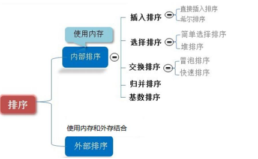

### 8.2冒泡排序

**冒泡排序**（Bubble Sorting）的基本思想是：通过对待排序序列从前向后（从下标较小的元素开始）,依次比较 相邻元素的值，若发现逆序则交换，使值较大的元素逐渐从前移向后部，就像水底下的气泡一样逐渐向上冒。 

- 优化： 因为排序的过程中，各元素不断接近自己的位置，如果一趟比较下来没有进行过交换，就说明序列有序，因此要在 排序过程中设置一个标志 flag 判断元素是否进行过交换。从而减少不必要的比较。

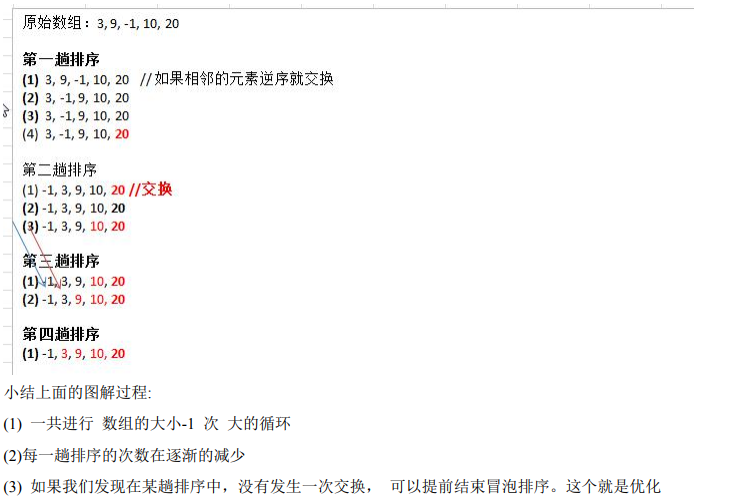

```java
//冒泡排序
public class BubbleSort {
    public static void main(String[] args) {
        int arr[]={3,9,-1,10,2};
        //提前将len储存好，防止每次for循环都要计算length浪费时间，使用空间换时间
        int len = arr.length;
        //标志位，优化冒泡排序
        boolean flag = false;

        //一共需要冒泡len-1次即可完成排序
        for(int i=0;i<len-1;i++){
            //因为上一次冒泡已经将前i为都固定到了正确的位置上，只需要将泡冒到len-1的位置即可
            for (int j=0;j<len-i-1;j++){
                if (arr[j]>arr[j+1]){
                    int temp = arr[j+1];
                    arr[j+1] = arr[j];
                    arr[j] = temp;
                    flag=true;
                }
            }
            //如果这一趟冒泡中没有发生位置交换，说明此时数组已经排序完成，退出循环即可
            if (!flag) break;
            flag = false;
            System.out.println(Arrays.toString(arr));
        }
    }
}
```

### 8.3选择排序

**选择排序**（select sorting）也是一种简单的排序方法。它的基本思想是：第一次从 arr[0]~arr[n-1]中选取最小值， 与 arr[0]交换，第二次从 arr[1]~arr[n-1]中选取最小值，与 arr[1]交换，第三次从 arr[2]~arr[n-1]中选取最小值，与 arr[2] 交换，…，第 i 次从 arr[i-1]~arr[n-1]中选取最小值，与 arr[i-1]交换，…, 第 n-1 次从 arr[n-2]~arr[n-1]中选取最小值， 与 arr[n-2]交换，总共通过 n-1 次，得到一个按排序码从小到大排列的有序序列

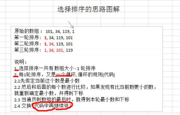

```java
public class SelectSort {
    public static void main(String[] args) {
        int arr[]={3,9,-1,10,2};
        //提前将len储存好，防止每次for循环都要计算length浪费时间，使用空间换时间
        int len = arr.length;
        //选择len-1次即可完成排序
        for (int i=0;i<len-1;i++){
            //假如第i个为最大
            int maxIndex = i;
            //将arr[i]与后面的数据依次比较，寻找最小的值的下标
            for (int j=i;j<len;j++)
                if (arr[maxIndex]<arr[j])
                    maxIndex=j;
                //将最小值与第i个值交换位置
            int temp = arr[i];
            arr[i] = arr[maxIndex];
            arr[maxIndex] = temp;
        }
        System.out.println(Arrays.toString(arr));
    }
}
```

### 8.4插入排序

**插入排序**（Insertion Sorting）的基本思想是：把 n 个待排序的元素看成为一个有序表和一个无序表，开始时有 序表中只包含一个元素，无序表中包含有 n-1 个元素，排序过程中每次从无序表中取出第一个元素，把它的排 序码依次与有序表元素的排序码进行比较，将它插入到有序表中的适当位置，使之成为新的有序表。

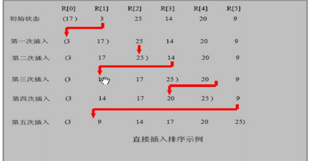

```java
public class InsertSort {
    public static void main(String[] args) {
        int arr[]={3,9,4,5,-2};
        //提前将len储存好，防止每次for循环都要计算length浪费时间，使用空间换时间
        int len = arr.length;

        //第一位只有一位数字，默认为其有序，从第二位开始
        for (int i=1;i<len;i++){
            int temp = arr[i];  //防止后面数组后移时数据丢失，提前创建中间变量储存数组
            int inserIndex = i-1;  //存放要插入的位置下标

            //在前面的有序部分寻找插入位置
            //insertIndex>=0让数组不越界，当inserIndex=-1时说名要将temp插入到0下标位置
            while(inserIndex>=0&&temp<arr[inserIndex]){
                arr[inserIndex+1] = arr[inserIndex];//将数组后移，腾出插入位置
                inserIndex--;
            }
            arr[inserIndex+1] = temp;
        }
        System.out.println(Arrays.toString(arr));
    }
}
```

### 8.4希尔排序

- 希尔排序是希尔（Donald Shell）于 1959 年提出的一种排序算法。希尔排序也是一种插入排序，它是简单插入排序经过改进之后的一个更高效的版本，也称为缩小增量排序。

- 希尔排序是把记录按下标的一定增量分组，对每组使用直接插入排序算法排序；随着增量逐渐减少，每组包含 的关键词越来越多，当增量减至 1 时，整个文件恰被分成一组，算法便终止

  

```Java
//增强冒泡
public static void shellSort(int[] arr) {
    for (int gap = arr.length / 2; gap > 0; gap /= 2) {
        for (int i = gap; i < arr.length; i++) {
                // 遍历各组中所有的元素(共 gap 组，每组有个元素), 步长 gap
            for (int j = i - gap; j >= 0; j -= gap) {//每一组使用冒泡排序
                // 如果当前元素大于加上步长后的那个元素，说明交换
                if (arr[j] > arr[j + gap]) {
                    int temp = arr[j];
                    arr[j] = arr[j + gap];
                    arr[j + gap] = temp;
                }
            }
        }
    }
}
//增强插入
public static void shellSort2(int[] arr){
    //提前将len储存好，防止每次for循环都要计算length浪费时间，使用空间换时间
    int len = arr.length;
    //gap表示分组的数目
    for (int gap = len/2;gap>0;gap/=2)
        for (int i = gap; i< len; i++){
                int temp = arr[i];
                int j = i;
                while (j-gap>=0&&temp<arr[j-gap]){
                    arr[j] = arr[j-gap];
                    j = j-gap;
                }
                arr[j] = temp;
            }
        }
}
```

### 8.5快速排序

- 快速排序（Quicksort）是对冒泡排序的一种改进。基本思想是：通过一趟排序将要排序的数据分割成独立的两 部分，其中一部分的所有数据都比另外一部分的所有数据都要小，然后再按此方法对这两部分数据分别进行快速排 序，整个排序过程可以递归进行，以此达到整个数据变成有序序列


```java
//快速排序
public static void quickSort(int[] arr,int l,int r){
    if (l>=r) return;    //如果数组只有一个数字则退出函数
    int left=l,right=r;
    int pivot = arr[left];  //选择最左边的数字作为中介值
    while (left<right){
        //将右指针逐步向左移动，直到寻找到比中介值小的值，或者右指针移动到和左指针相同
        while (left<right&&arr[right]>=pivot) {
            right--;    //移动指针
        }
        if (left<right)
            arr[left]=arr[right];   //将右指针的值移动到做指针上

        //开始移动左指针，寻找比中介值大的值
        while (left<right&&arr[left]<=pivot){
            left++;     //移动指针
        }
        if (left<right)
            arr[right] = arr[left]; //将左指针的值赋给右指针
    }

    arr[left] = pivot;  //将中介值放到合适的位置
    //System.out.println(Arrays.toString(arr)+"left:"+left+"right:"+right);
    quickSort(arr, l, left-1);  //将中介值左边的部分递归这一过程，由于中介值已经在正确的位置上面了，所以不需要使用left，而是使用left-1，+1
    quickSort(arr, left+1, r);  //将中介值右边的部分递归这一过程
}
```

### 8.6归并排序

- 归并排序（MERGE-SORT）是利用归并的思想实现的排序方法，该算法采用经典的分治（divide-and-conquer） 策略（分治法将问题分(divide)成一些小的问题然后递归求解，而治(conquer)的阶段则将分的阶段得到的各答案"修 补"在一起，即分而治之)

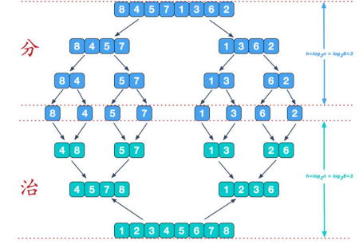

   		再来看看治阶段，我们需要将两个已经有序的子序列合并成一个有序序列，比如上图中的最后一次合并，要将 [4,5,7,8]和[1,2,3,6]两个已经有序的子序列，合并为最终序列[1,2,3,4,5,6,7,8]

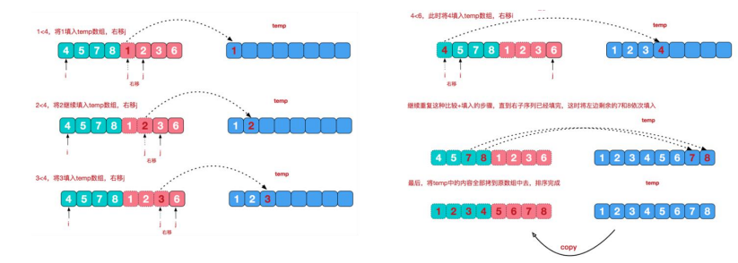

```java
//分+合方法
public static void mergeSort(int[] arr, int left, int right, int[] temp) {
    if(left<right){
        int mid = (left+right)>>1;
        mergeSort(arr, left, mid,temp);
        mergeSort(arr, mid+1, right,temp);
        //分成每个数组只有一个数字时，开始治
        merge(arr, left, mid, right, temp);
    }
}
public static void merge(int[] arr, int left, int mid, int right, int[] temp) {
    int i=left;     //指向左边序列
    int j=mid+1;    //指向右边序列
    int t=0;        //指向中介数组
    //依次将两个有序数组合并到中介数组中，当有一边数组合并完之后推出循环
    while(i<=mid&&j<=right)
        if (arr[i]>arr[j])
            temp[t++] = arr[j++];
        else
            temp[t++] = arr[i++];
    //检查两边数组的数是否都已经放到中介数组中，没有的话将其依次放入
    while (i<=mid)
        temp[t++] = arr[i++];
    while (j<=right)
        temp[t++] = arr[j++];
    //将中介数组的内容拷贝到原数组中
    t=0;
    while (left<=right)
        arr[left++] = temp[t++];
}
```

### 8.7基数排序

- 基数排序（radix sort）属于“分配式排序”（distribution sort），又称“桶子法”（bucket sort）或 bin sort，顾 名思义，它是通过键值的各个位的值，将要排序的元素分配至某些“桶”中，达到排序的作用
- 基数排序法是属于稳定性的排序，基数排序法的是效率高的稳定性排序法
- 基数排序(Radix Sort)是桶排序的扩展
- 基数排序是 1887 年赫尔曼·何乐礼发明的。它是这样实现的：将整数按位数切割成不同的数字，然后按每个 位数分别比较。

将数组 {53, 3, 542, 748, 14, 214} 使用基数排序, 进行升序排序

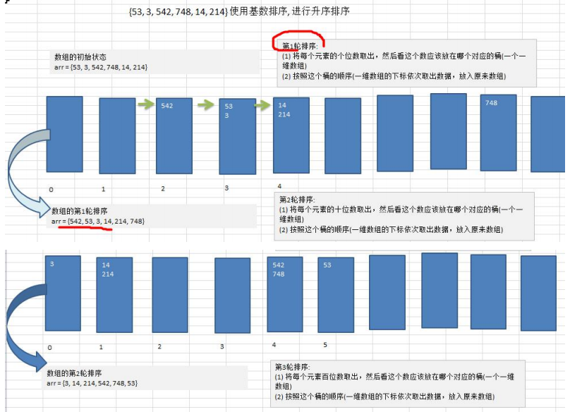

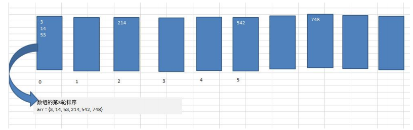

### 8.8堆排序

- 堆排序是利用堆这种数据结构而设计的一种排序算法，堆排序是一种选择排序，它的最坏，最好，平均时间复 杂度均为 O(nlogn)，它也是不稳定排序。
- 堆是具有以下性质的完全二叉树：每个结点的值都大于或等于其左右孩子结点的值，称为大顶堆, 注意 : 没有 要求结点的左孩子的值和右孩子的值的大小关系。
- 每个结点的值都小于或等于其左右孩子结点的值，称为小顶堆
- 大顶堆举例说明

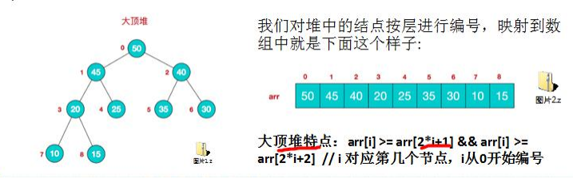

- 小顶堆举例说明 

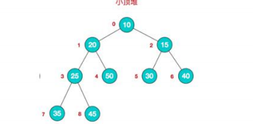

- 一般升序采用大顶堆，降序采用小顶堆

**基本思想**： 

1) 将待排序序列构造成一个大顶堆
2) 此时，整个序列的最大值就是堆顶的根节点。
3) 将其与末尾元素进行交换，此时末尾就为最大值。
4) 然后将剩余 n-1 个元素重新构造成一个堆，这样会得到 n 个元素的次小值。如此反复执行，便能得到一个有序 序列了

图解

**步骤一** 构造初始堆。将给定无序序列构造成一个大顶堆（一般升序采用大顶堆，降序采用小顶堆)。 原始的数组 [4, 6, 8, 5, 9] 

1) .假设给定无序序列结构如下 

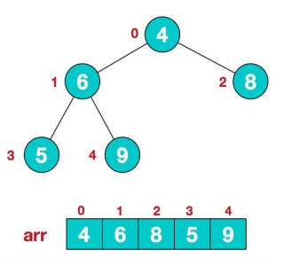

2. 此时我们从最后一个非叶子结点开始（叶结点自然不用调整，第一个非叶子结点 arr.length/2-1=5/2-1=1，也就是下面的 6 结点），从左至右，从下至上进行调整。

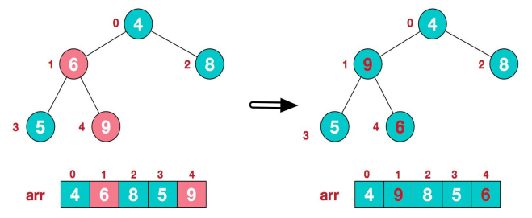

3. 找到第二个非叶节点 4，由于[4,9,8]中 9 元素最大，4 和 9 交换。

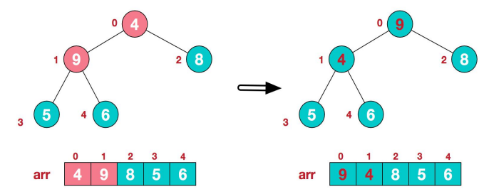

4. 这时，交换导致了子根[4,5,6]结构混乱，继续调整，[4,5,6]中 6 最大，交换 4 和 6。 此时，我们就将一个无序序列构造成了一个大顶堆。 

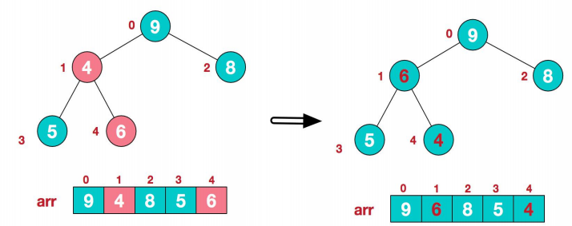

**步骤二** 将堆顶元素与末尾元素进行交换，使末尾元素最大。然后继续调整堆，再将堆顶元素与末尾元素交换，得到第二大元素。如此反复进行交换、重建、交换。 

1) .将堆顶元素 9 和末尾元素 4 进行交换 

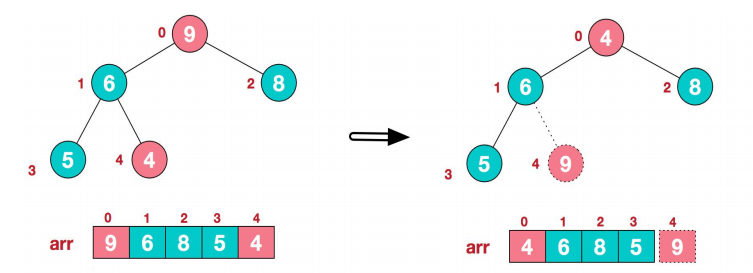

2. 重新调整结构，使其继续满足堆定义 

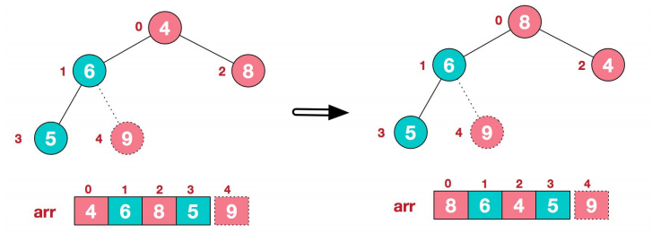

3. 再将堆顶元素 8 与末尾元素 5 进行交换，得到第二大元素 8

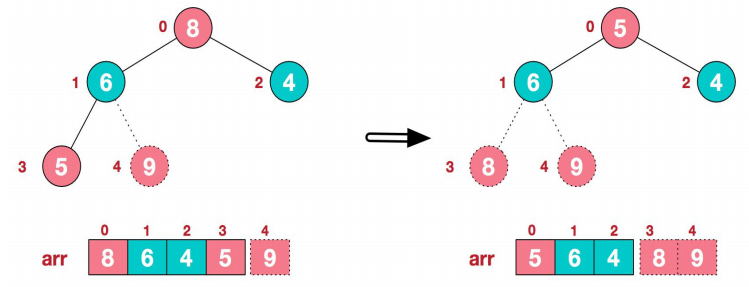

4. 后续过程，继续进行调整，交换，如此反复进行，最终使得整个序列有序

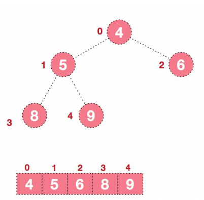

**代码实现**

```java
public static void heapSort(int arr[]) {
    //将无序的数组组成一个大顶堆
    //length/2-1表示堆的最后（底层）一个非叶子节点
    for (int i=arr.length/2-1;i>=0;i--) 
        adjustHeap(arr, i,arr.length);

    for(int j = arr.length-1;j>0;j--){
        int temp = arr[j];
        arr[j] = arr[0];
        arr[0] = temp;
        //执行完构建堆的for循之后就不需要每次都从底向上构建了，只需要从根节点开始扫描最大值
        adjustHeap(arr, 0, j);
    }
}
public static void adjustHeap(int arr[], int i, int lenght) {
    int temp = arr[i];
    for (int k = 2*i+1;k<lenght;k=2*k+1){
        if (k<lenght-1&&arr[k]<arr[k+1]) k++;   //比较左右俩个子树的大小，哪个大k取哪个
        if (arr[k]>temp){   //当左右子树大于了父节点时，将子节点赋值给子树
            arr[i]=arr[k];
            i=k;    //将i指向k，因为假如改变子树和其父节点的位置时，可能影响到子节点的子节点的位置，所以要继续循环
        }else {
            break;  //位置合适退出循环即可
        }
    }
    arr[i] = temp;
}
```

### 8.9常用排序算法总结和对比

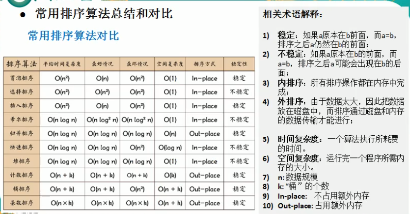


