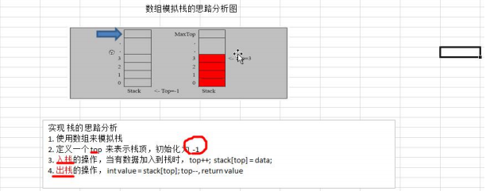

## 5.链表

### 5.1链表介绍

链表是有序的列表，但是它在内存中是存储如下


链表是以节点的方式来存储,是链式存储 

每个节点包含 data 域， next 域：指向下一个节点. 

如图：发现链表的各个节点不一定是连续存储.

链表分带头节点的链表和没有头节点的链表，根据实际的需求来确定

### 5.2单链表的应用实例

使用带 head 头的单向链表实现 –水浒英雄排行榜管理完成对英雄人物的增删改查操作

```java
//定义英雄节点
class HeroNode{
    public int no;          //编号
    public String name;     //名称
    public String nickName; //外号
    public HeroNode next;   //指向下一个节点的指针
}

//定义单链表
class SingleLinkedList{
    //初始化头节点
    private HeroNode head  = new HeroNode(0,"","");
}
```

#### 5.2.1增删改节点

- 添加节点


- 根据排名添加节点


- 删除和修改同理

#### 5.2.2复杂功能

- 求单链表中有效节点的个数

```java
    public int getLength(HeroNode head){
        int length =0;
        while (head.next!=null){
            length++;
            head = head.next;
        }
        return length;
    }
```

- 查找单链表中的倒数第 k 个结点

```java
//***使用快慢指针一次遍历实现查找链表的倒数第n个节点***
public HeroNode findLastIndexNode(HeroNode head,int n){
    if (head.next==null)
        throw new RuntimeException("链表为空!!!");
     HeroNode fast = head.next;
     HeroNode slow = head.next;
     while (fast.next!=null){
         //快指针先移动
         fast = fast.next;
         if (n!=1)
             n--;
         else
             //当快指针移动了n次时，代表快慢指针相隔n，慢指针可以开始移动，此时当快指针移动到链表的尾部时，慢指针指向的是链表倒数第n个节点
             slow = slow.next;
         //当快指针已经到达链表尾部时，快慢指针相隔任然小于n，说明n小于了链表的长度
         if (fast.next==null&&n>1)
             throw new RuntimeException("n大于了链表的长度!!!");
     }
     return slow;
}
```

- 单链表的反转


```java
//头插法实现链表的逆转
public void reversetList(HeroNode head){
    if (head.next==null||head.next.next==null)
        throw new RuntimeException("链表为空!!!");
    //将原来链表上面的节点依次插到该链表后
    HeroNode revHead = new HeroNode(0, "", "");
    HeroNode temp;
    while (head.next!=null){
        temp = head.next.next;          //temp用来保存与那链表的第二个节点，以防止数据丢失
        head.next.next=revHead.next;    //将原链表的第一个节点的next指向反转链表的第一个节点
        revHead.next = head.next;       //将反转链表的头结点的next指向原链表的第一个节点
        head.next = temp;               //原链表的第一个节点此时已经转移为了反转链表的第一个节点，将原链表的第二个节点作为原链表的第一个节点
    }
    //此处不能head = revHead 因为函数结束之后，revHead作为局部变量会失效
    head.next = revHead.next;
}
```

- 从尾到头打印单链表 

```java
//递归实现逆序打印链表内容
public void reversePrint1(HeroNode head){
    if(head.next == null) {
        return;//空链表，不能打印
    }
    //当head.next指向链表尾节点时递归结束
    if (head.next.next==null)
        System.out.println(head.next);
    else{
        reversePrint1(head.next);
        System.out.println(head.next);
    }
}

//使用栈Stack逆序打印链表内容
public void reversePrint2(HeroNode head){
    if(head.next == null) {
        return;//空链表，不能打印
    }
    //创建要给一个栈，将各个节点压入栈
    Stack<HeroNode> stack = new Stack<HeroNode>();
    HeroNode cur = head.next;
    //将链表的所有节点压入栈
    while(cur != null) {
        stack.push(cur);
        cur = cur.next; //cur 后移，这样就可以压入下一个节点
    }
    //将栈中的节点进行打印,pop 出栈
    while (stack.size() > 0) {
        System.out.println(stack.pop()); //stack 的特点是先进后出
    }
}
```

### 5.3双向链表

**单向链表的缺点分析**: 

- 单向链表，查找的方向只能是一个方向，而双向链表可以向前或者向后查找。 
- 单向链表不能自我删除，需要靠辅助节点 ，而双向链表，则可以自我删除，所以前面我们单链表删除 时节点，总是找到 temp,temp 是待删除节点的前一个节点(认真体会）

**代码实现**

```java
class HeroNode2 {
public int no;
public String name;
public String nickname;
public HeroNode2 next; // 指向下一个节点, 默认为 null
public HeroNode2 pre; // 指向前一个节点, 默认为 null
}
```

### 5.4环形链表-约瑟夫问题

#### 5.4.1约瑟夫问题

Josephu(约瑟夫、约瑟夫环) 问题为：设编号为 1，2，… n 的 n 个人围坐一圈，约定编号为 k（1<=k<=n）的人从 1 开始报数，数 到 m 的那个人出列，它的下一位又从 1 开始报数，数到 m 的那个人又出列，依次类推，直到所有人出列为止，由 此产生一个出队编号的序列。

#### 5.4.2解决思路

用一个不带头结点的循环链表来处理 Josephu 问题：先构成一个有 n 个结点的单循环链表，然后由 k 结点起从 1 开 始计数，计到 m 时，对应结点从链表中删除，然后再从被删除结点的下一个结点又从 1 开始计数，直到最后一个 尚硅谷 Java 数据结构和算法 更多 Java –大数据 –前端 –python 人工智能 -区块链资料下载，可访问百度：尚硅谷官网 第 55页 结点从链表中删除算法结束。


#### 5.4.3代码实现

```java
// 创建一个 Boy 类，表示一个节点
class Boy {
    private int no;// 编号
    private Boy next; // 指向下一个节点,默认 null
}
// 根据用户的输入，计算出小孩出圈的顺序
/**
     *
     * @param startNo
     * 表示从第几个小孩开始数数
     * @param countNum
     * 表示数几下
     * @param nums
     * 表示最初有多少小孩在圈中
     */
public void countBoy(int startNo, int countNum, int nums) {

    if (nums<1||countNum<1||first==null||startNo<1||startNo>nums)
        throw new RuntimeException("参数有误，从新输入！！");
    //创建辅助指针，指向环形链表的最后一个节点
    Boy helper = first;
    while (helper.getNext()!=first){
        helper = helper.getNext();
    }
    //移动helper和first，使从第startNo个小孩开始数
    for (int i=0;i<(startNo-1);i++){
        helper = helper.getNext();
        first = first.getNext();
    }
    //开始数数，出圈
    while (helper!=first){
        //报数
        for (int i=0;i<(countNum-1);i++){
            helper = helper.getNext();
            first = first.getNext();
        }
        System.out.println("小孩"+ first.getNo() +"出队列：" );
        first = first.getNext();
        helper.setNext(first);

    }
    System.out.println("最后的小孩："+ first.getNo());
}
```

## 6.栈

### 6.1栈的介绍

- 栈的英文为(stack) 
- 栈是一个先入后出(FILO-First In Last Out)的有序列表。
- 栈(stack)是限制线性表中元素的插入和删除只能在线性表的同一端进行的一种特殊线性表。允许插入和删除的 一端，为变化的一端，称为栈顶(Top)，另一端为固定的一端，称为栈底(Bottom)。
- 根据栈的定义可知，最先放入栈中元素在栈底，最后放入的元素在栈顶，而删除元素刚好相反，最后放入的元 素最先删除，最先放入的元素最后删除 
- 图解方式说明出栈(pop)和入栈(push)的概念


**应用场景**

1) 子程序的调用：在跳往子程序前，会先将下个指令的地址存到堆栈中，直到子程序执行完后再将地址取出，以回到原来的程序中。 
2) 处理递归调用：和子程序的调用类似，只是除了储存下一个指令的地址外，也将参数、区域变量等数据存入堆栈中。 
3) 表达式的转换[中缀表达式转后缀表达式]与求值(实际解决)。
4) 二叉树的遍历。 
5) 图形的深度优(depth 一 first)搜索法。

### 6.2数组实现栈

##### 

```java
class ArrayStack{
    private int maxSize;
    private int[] stack;
    private int top;
    public ArrayStack(int maxSize) {
        this.maxSize = maxSize;
        stack = new int[maxSize];
        top = -1;
    }
    public boolean isFull(){return top==maxSize-1;}
    public boolean isEmpty(){return top ==-1;}
    //入栈
    public void push(int value){
        if (isFull())
            throw new RuntimeException("栈满！！！");
        top++;
        stack[top] = value;
    }
    //出栈
    public int pop(){
        if (isEmpty())
            throw new RuntimeException("栈空！！！");
        top--;
        return stack[top+1];
    }
    //从栈顶开始输出栈内的数据
    public void list(){
        for (int i=top;i>=0;i--)
            System.out.printf("stack[%d]=%d\n", i, stack[i]);
    }
}
```

### 6.3栈实现综合计算器(中缀表达式)

.png)

**具体代码见 package com.yue.stack.Calculator**

### 6.4前后中缀表达式

- 前缀、中缀、后缀表达式是对表达式的不同记法，其区别在于**运算符相对于操作数的位置不同**，前缀表达式的运算符位于操作数之前，中缀和后缀同理
  - 中缀表达式：1 + (2 + 3) × 4 - 5
  - 前缀表达式：- + 1 × + 2 3 4 5
  - 后缀表达式：1 2 3 + 4 × + 5 -

**前缀表达式**

- 中缀表达式是一种通用的算术或逻辑公式表示方法，操作符以中缀形式处于操作数的中间。中缀表达式是人们常用的算术表示方法。
- 虽然人的大脑很容易理解与分析中缀表达式，但对计算机来说中缀表达式却是很复杂的，因此计算表达式的值时，通常需要先将中缀表达式转换为前缀或后缀表达式，然后再进行求值。**对计算机来说，计算前缀或后缀表达式的值非常简单**。

#### 6.4.1中缀表达式转化为前缀和后缀表达式

1. 按照运算符的优先级对所有的运算单位加括号
2. 将运算符移动到对应括号的前面（前缀表达式）或后面（后缀表达式）
3. 去掉括号，得到前缀或后缀表达式

示例：中缀表达式：1+(2+3)×4-5

1）**加括号**
	式子变成 ((1+((2+3)×4))-5)

2）**移动运算符**

​	对于前缀表达式，变成了 -(+(1×(+(23)4))5)

​	对于后缀表达式：变成了((1((23)+4)×)+5)-

3）**去掉括号**
	前缀表达式： - + 1 × + 2 3 4 5
	后缀表达式：1 2 3 + 4 × + 5 -

### 6.5 逆波兰计算器 

我们完成一个逆波兰计算器，要求完成如下任务: 

- 输入一个逆波兰表达式(后缀表达式)，使用栈(Stack), 计算其结果 
- 支持小括号和多位数整数，因为这里我们主要讲的是数据结构，因此计算器进行简化，只支持对整数的计算。

```java
//完成对逆波兰表达式的运算
/*
1)从左至右扫描，将 3 和 4 压入堆栈；
2)遇到+运算符，因此弹出 4 和 3（4 为栈顶元素，3 为次顶元素），计算出 3+4 的值，得 7，再将 7 入栈；
3)将 5 入栈；
4)接下来是×运算符，因此弹出 5 和 7，计算出 7×5=35，将 35 入栈；
5)将 6 入栈；
6)最后是-运算符，计算出 35-6 的值，即 29，由此得出最终结果
*/
public static int calculate(List<String> ls){
    Stack<String> stack = new Stack();
    for (String item:ls){
        if (item.matches("\\d+")){//使用正则表达式来匹配字符串是否是多位数
            stack.push(item);
        }else {
            //假如不是的话就pop出两个数进行运算，将结果再入栈
            int num2 = Integer.parseInt(stack.pop());
            int num1 = Integer.parseInt(stack.pop());
            int res = 0;
            if (item.equals("+")) {
                res = num1 + num2;
            } else if (item.equals("-")) {
                res = num1 - num2;
            } else if (item.equals("*")) {
                res = num1 * num2;
            } else if (item.equals("/")) {
                res = num1 / num2;
            } else {
                throw new RuntimeException("运算符有误");
            }
            //把 res 入栈
            stack.push("" + res);
        }
    }
    return Integer.parseInt(stack.pop());
}
```

### 6.6 中缀表达式转换为后缀表达式

1. 初始化两个栈：运算符栈 s1 和储存中间结果的栈 s2； 

2. 从左至右扫描中缀表达式； 

3. 遇到操作数时，将其压 s2； 

4. 遇到运算符时，比较其与 s1 栈顶运算符的优先级： 

   ①.如果 s1 为空，或栈顶运算符为左括号“(”，则直接将此运算符入栈； 

   ②.否则，若优先级比栈顶运算符的高，也将运算符压入 s1； 

   ③.否则，将 s1 栈顶的运算符弹出并压入到 s2 中，再次转到(4-1)与 s1 中新的栈顶运算符相比较；

   （弹出优先级大于等于自己的运算符号，直到遇到‘）’或者栈空）

5. 遇到括号时：

   ① 如果是左括号“(”，则直接压入 s1 

   ② 如果是右括号“)”，则依次弹出 s1 栈顶的运算符，并压入 s2，直到遇到左括号为止，此时将这一对括号丢弃 

6. 重复步骤 2 至 5，直到表达式的最右边

7. 将 s1 中剩余的运算符依次弹出并压入 s2 

8. 依次弹出 s2 中的元素并输出，结果的逆序即为中缀表达式对应的后缀表达式


```java
//即 ArrayList [1,+,(,(,2,+,3,),*,4,),-,5] =》 ArrayList [1,2,3,+,4,*,+,5,–]
//方法：将得到的中缀表达式对应的 List => 后缀表达式对应的 List
public static List<String> parseSuffixExpreesionList(List<String> ls) {
    //定义两个栈
    Stack<String> s1 = new Stack<String>(); // 符号栈
    //说明：因为 s2 这个栈，在整个转换过程中，没有 pop 操作，而且后面我们还需要逆序输出
    //因此比较麻烦，这里我们就不用 Stack<String> 直接使用 List<String> s2
    //Stack<String> s2 = new Stack<String>(); // 储存中间结果的栈 s2
    List<String> s2 = new ArrayList<String>(); // 储存中间结果的 Lists2
    //遍历 ls
    for(String item: ls) {
        //如果是一个数，加入 s2
        if(item.matches("\\d+")) {
            s2.add(item);
        } else if (item.equals("(")) {
            s1.push(item);
        } else if (item.equals(")")) {
            //如果是右括号“)”，则依次弹出 s1 栈顶的运算符，并压入 s2，直到遇到左括号为止，此时将这一对括号丢弃
            while(!s1.peek().equals("(")) {
                s2.add(s1.pop());
            }
            s1.pop();//!!! 将 ( 弹出 s1 栈， 消除小括号
        } else {
            //当 item 的优先级小于等于 s1 栈顶运算符, 将 s1 栈顶的运算符弹出并加入到 s2 中，再次转到(4.1)与 s1 中新的栈顶运算符相比较
            //问题：我们缺少一个比较优先级高低的方法
            while(s1.size() != 0 && Operation.getValue(s1.peek()) >= Operation.getValue(item) ) {
                s2.add(s1.pop());
            }
            //还需要将 item 压入栈
            s1.push(item);
        }
    }
    //将 s1 中剩余的运算符依次弹出并加入 s2
    while(s1.size() != 0) {
        s2.add(s1.pop());
    }
    return s2; //注意因为是存放到 List, 因此按顺序输出就是对应的后缀表达式对应的 List
}
```

