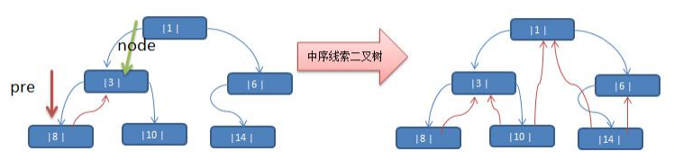

## 11.树结构

### 11.1为什么需要树这种数据结构

1) 数组存储方式的分析 优点：通过下标方式访问元素，速度快。对于有序数组，还可使用二分查找提高检索速度。 缺点：如果要检索具体某个值，或者插入值(按一定顺序)会整体移动，效率较低


2) 链式存储方式的分析 优点：在一定程度上对数组存储方式有优化(比如：插入一个数值节点，只需要将插入节点，链接到链表中即可， 删除效率也很好)。 缺点：在进行检索时，效率仍然较低，比如(检索某个值，需要从头节点开始遍历) 


3) 树存储方式的分析 能提高数据存储，读取的效率, 比如利用 二叉排序树(Binary Sort Tree)，既可以保证数据的检索速度，同时也 可以保证数据的插入，删除，修改的速度。


### 11.2树的常用术语

树的常用术语(结合示意图理解): 

- 节点 
- 根节点
- 父节点 
- 子节点 
- 叶子节点 (没有子节点的节点)
- 节点的权(节点值) 
- 路径(从 root 节点找到该节点的路线) 
- 层 
- 子树
- 树的高度(最大层数) 
- 森林 :多颗子树构成森林


### 11.3二叉树

- 树有很多种，每个节点最多只能有两个子节点的一种形式称为二叉树。 

- 二叉树的子节点分为左节点和右节点


- 如果该二叉树的所有叶子节点都在最后一层，并且结点总数= 2^n -1 , n 为层数，则我们称为**满二叉树**


- 如果该二叉树的所有叶子节点都在最后一层或者倒数第二层，而且最后一层的叶子节点在左边连续，倒数第二 层的叶子节点在右边连续，我们称为**完全二叉树**


#### 11.3.2二叉树-遍历

前序遍历: 先输出父节点，再遍历左子树和右子树 

中序遍历: 先遍历左子树，再输出父节点，再遍历右子树 

后序遍历: 先遍历左子树，再遍历右子树，最后输出父节点


```java
//树的节点
class HeroNode{
    private int no;
    private String name;
    private HeroNode left;  //左右节点
    private HeroNode right;
}
//前序遍历
public void preOrder(HeroNode node){
    if (node == null) throw new RuntimeException("树为空！！！");
    System.out.println(node.getNo());
    if (node.getLeft()!=null) preOrder(node.getLeft());
    if (node.getRight()!=null) preOrder(node.getRight());
}
//中序遍历
public void infixOrder(HeroNode node){
    if (node == null) throw new RuntimeException("树为空！！！");
    if (node.getLeft()!=null) infixOrder(node.getLeft());
    System.out.println(node.getNo());
    if (node.getRight()!=null) infixOrder(node.getRight());
}
//后序遍历
public void postOrder(HeroNode node){
    if (node == null) throw new RuntimeException("树为空！！！");
    if (node.getLeft()!=null) postOrder(node.getLeft());
    if (node.getRight()!=null) postOrder(node.getRight());
    System.out.println(node.getNo());
}
```

#### 11.3.3二叉树-查找指定节点


```java
//前序遍历查找
public HeroNode preOrderSearch(HeroNode node,int no){
    if (node == null) throw new RuntimeException("树为空！！！");
    HeroNode resNode = null;    //假如查找到节点就放到resNode中，以方便判断递归的停止
    if (node.getNo()==no) return node;
    if (node.getLeft()!=null) resNode = preOrderSearch(node.getLeft(),no);
    if (resNode!=null) return resNode;  //在左分支上面查找到结果的话就结束递归，不在进入右分支
    if (node.getRight()!=null)resNode = preOrderSearch(node.getRight(),no);
    if (resNode!=null) return resNode;
    return null;
}
```


#### 11.3.4二叉树-删除指定节点


```java
//Tree
public void delNode(int no){
    if (root == null) throw new RuntimeException("树为空！！！");
    if (root.getNo() == no) root=null;
    else root.delNode(no);
}
//Node
public void delNode(int no){
    if (this.left!=null){
        if (this.left.getNo()==no){
            this.left=null;
        }else
            this.left.delNode(no);
    }
    if (this.right!=null){
        if (this.right.getNo()==no){
            this.right=null;
        }else
            this.right.delNode(no);
    }

}
```

### 11.4顺序存储二叉树

- 从数据存储来看，数组存储方式和树的存储方式可以相互转换，即数组可以转换成树，树也可以转换成数组， 看右面的示意图


#### 11.4.1顺序存储二叉树的特点

- 顺序二叉树通常只考虑完全二叉树
- 第 n 个元素的左子节点为 2 * n + 1
- 第 n 个元素的右子节点为 2 * n + 2
- 第 n 个元素的父节点为 (n-1) / 2 
- n : 表示二叉树中的第几个元素

**顺序存储二叉树前序遍历**

```java
public void preOrder(int index){

    if (arr==null||arr.length==0) 
        throw new RuntimeException("树为空！！！");
    System.out.println(arr[index]);
    if (2*index+1<arr.length) preOrder(2*index+1);
    if (2*index+2<arr.length) preOrder(2*index+2);
}
```

### 11.5线索化二叉树

#### 11.5.1常规二叉树的问题

将数列 {1, 3, 6, 8, 10, 14 } 构建成一颗二叉树. n+1=7


**问题分析:** 

1) 当我们对上面的二叉树进行中序遍历时，数列为 {8, 3, 10, 1, 6, 14 }
2) 但是 6, 8, 10, 14 这几个节点的 左右指针，并没有完全的利用上.
3) 如果我们希望充分的利用 各个节点的左右指针， 让各个节点可以指向自己的前后节点,怎么办? 
4) 解决方案-线索二叉树

#### 11.5.2线索二叉树

- n 个结点的二叉链表中含有 n+1 【公式 2n-(n-1)=n+1】 个空指针域。利用二叉链表中的空指针域，存放指向 该结点在某种遍历次序下的前驱和后继结点的指针（这种附加的指针称为"线索"）
- 这种加上了线索的二叉链表称为线索链表，相应的二叉树称为线索二叉树(Threaded BinaryTree)。根据线索性质 的不同，线索二叉树可分为前序线索二叉树、中序线索二叉树和后序线索二叉树三种
- 一个结点的前一个结点，称为前驱结点
- 一个结点的后一个结点，称为后继结点



说明: 当线索化二叉树后，Node 节点的 属性 left 和 right ，有如下情况:

- left 指向的是左子树，也可能是指向的前驱节点. 比如 ① 节点 left 指向的左子树, 而 ⑩ 节点的 left 指向的 就是前驱节点. 

- right 指向的是右子树，也可能是指向后继节点，比如 ① 节点 right 指向的是右子树，而⑩ 节点的 right 指向 的是后继节点

**代码实现**

```java
//树的节点
class HeroNode{
    private int no;
    private String name;
    private HeroNode left;  //左右节点
    private HeroNode right;
    //标记左节点是否指向前驱节点，1指向前驱节点，指向左节点
    private int leftTag=0;    
    //标记右节点是否指向后继节点，1指向后继节点，指向右节点
    private int rightTag=0;   
}
//中序遍历线索二叉树
    public void threadedNodes(HeroNode node){
        if (node==null) return;
        if (node.getLeft()!=null) threadedNodes(node.getLeft());
        if (node.getLeft()==null){
            node.setLeft(pre);
            node.setLeftTag(1);
        }
        if (pre!=null&&pre.getRight()==null){
            pre.setRight(node);
            System.out.println(node);
            pre.setRightTag(1);
        }
        //当左子树遍历完之后，将左子树设置为前驱节点
        pre = node;
        if (node.getRight()!=null) threadedNodes(node.getRight());
    }
```

#### 11.5.3遍历线索化二叉树

- 因为线索化后，各个结点指向有变化，因此原来的遍历方式不能使用，这时需要使用新的方式遍历 线索化二叉树，各个节点可以通过线型方式遍历，因此无需使用递归方式，这样也提高了遍历的效率。 遍历的次 序应当和中序遍历保持一致。

```java
/遍历线索化二叉树的方法
public void threadedList(){
    HeroNode node = root;
    if (node==null) return;
    while (node!=null){
        //循环的找到 leftType == 1 的结点，第一个找到就是 8 结点
        //后面随着遍历而变化,因为当 leftType==1 时，说明该结点是按照线索化
        //处理后的有效结点
        while (node.getLeftTag()==0)
            node = node.getLeft();
        System.out.println(node);
        while (node.getRightTag()==1){
            node = node.getRight();
            System.out.println(node);
        }
        node = node.getRight();
    }
```

## 12.树结构的实际应用

### 12.1堆排序

**见8.8堆排序**

### 12.2赫夫曼树

## 13.多路查找树