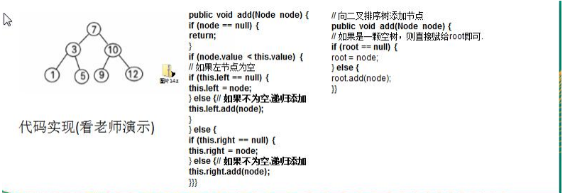
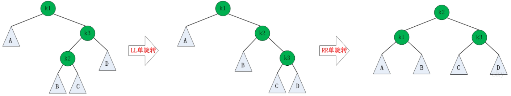
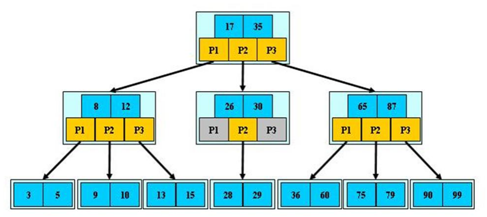

## 11.树结构

### 11.1为什么需要树这种数据结构

1) 数组存储方式的分析 优点：通过下标方式访问元素，速度快。对于有序数组，还可使用二分查找提高检索速度。 缺点：如果要检索具体某个值，或者插入值(按一定顺序)会整体移动，效率较低


2) 链式存储方式的分析 优点：在一定程度上对数组存储方式有优化(比如：插入一个数值节点，只需要将插入节点，链接到链表中即可， 删除效率也很好)。 缺点：在进行检索时，效率仍然较低，比如(检索某个值，需要从头节点开始遍历) 


3) 树存储方式的分析 能提高数据存储，读取的效率, 比如利用 二叉排序树(Binary Sort Tree)，既可以保证数据的检索速度，同时也 可以保证数据的插入，删除，修改的速度。


### 11.2树的常用术语

树的常用术语(结合示意图理解): 

- 节点 
- 根节点
- 父节点 
- 子节点 
- 叶子节点 (没有子节点的节点)
- 节点的权(节点值) 
- 路径(从 root 节点找到该节点的路线) 
- 层 
- 子树
- 树的高度(最大层数) 
- 森林 :多颗子树构成森林


### 11.3二叉树

- 树有很多种，每个节点最多只能有两个子节点的一种形式称为二叉树。 

- 二叉树的子节点分为左节点和右节点


- 如果该二叉树的所有叶子节点都在最后一层，并且结点总数= 2^n -1 , n 为层数，则我们称为**满二叉树**


- 如果该二叉树的所有叶子节点都在最后一层或者倒数第二层，而且最后一层的叶子节点在左边连续，倒数第二 层的叶子节点在右边连续，我们称为**完全二叉树**


#### 11.3.2二叉树-遍历

前序遍历: 先输出父节点，再遍历左子树和右子树 

中序遍历: 先遍历左子树，再输出父节点，再遍历右子树 

后序遍历: 先遍历左子树，再遍历右子树，最后输出父节点


```java
//树的节点
class HeroNode{
    private int no;
    private String name;
    private HeroNode left;  //左右节点
    private HeroNode right;
}
//前序遍历
public void preOrder(HeroNode node){
    if (node == null) throw new RuntimeException("树为空！！！");
    System.out.println(node.getNo());
    if (node.getLeft()!=null) preOrder(node.getLeft());
    if (node.getRight()!=null) preOrder(node.getRight());
}
//中序遍历
public void infixOrder(HeroNode node){
    if (node == null) throw new RuntimeException("树为空！！！");
    if (node.getLeft()!=null) infixOrder(node.getLeft());
    System.out.println(node.getNo());
    if (node.getRight()!=null) infixOrder(node.getRight());
}
//后序遍历
public void postOrder(HeroNode node){
    if (node == null) throw new RuntimeException("树为空！！！");
    if (node.getLeft()!=null) postOrder(node.getLeft());
    if (node.getRight()!=null) postOrder(node.getRight());
    System.out.println(node.getNo());
}
```

#### 11.3.3二叉树-查找指定节点


```java
//前序遍历查找
public HeroNode preOrderSearch(HeroNode node,int no){
    if (node == null) throw new RuntimeException("树为空！！！");
    HeroNode resNode = null;    //假如查找到节点就放到resNode中，以方便判断递归的停止
    if (node.getNo()==no) return node;
    if (node.getLeft()!=null) resNode = preOrderSearch(node.getLeft(),no);
    if (resNode!=null) return resNode;  //在左分支上面查找到结果的话就结束递归，不在进入右分支
    if (node.getRight()!=null)resNode = preOrderSearch(node.getRight(),no);
    if (resNode!=null) return resNode;
    return null;
}
```


#### 11.3.4二叉树-删除指定节点


```java
//Tree
public void delNode(int no){
    if (root == null) throw new RuntimeException("树为空！！！");
    if (root.getNo() == no) root=null;
    else root.delNode(no);
}
//Node
public void delNode(int no){
    if (this.left!=null){
        if (this.left.getNo()==no){
            this.left=null;
        }else
            this.left.delNode(no);
    }
    if (this.right!=null){
        if (this.right.getNo()==no){
            this.right=null;
        }else
            this.right.delNode(no);
    }

}
```

### 11.4顺序存储二叉树

- 从数据存储来看，数组存储方式和树的存储方式可以相互转换，即数组可以转换成树，树也可以转换成数组， 看右面的示意图


#### 11.4.1顺序存储二叉树的特点

- 顺序二叉树通常只考虑完全二叉树
- 第 n 个元素的左子节点为 2 * n + 1
- 第 n 个元素的右子节点为 2 * n + 2
- 第 n 个元素的父节点为 (n-1) / 2 
- n : 表示二叉树中的第几个元素

**顺序存储二叉树前序遍历**

```java
public void preOrder(int index){

    if (arr==null||arr.length==0) 
        throw new RuntimeException("树为空！！！");
    System.out.println(arr[index]);
    if (2*index+1<arr.length) preOrder(2*index+1);
    if (2*index+2<arr.length) preOrder(2*index+2);
}
```

### 11.5线索化二叉树

#### 11.5.1常规二叉树的问题

将数列 {1, 3, 6, 8, 10, 14 } 构建成一颗二叉树. n+1=7


**问题分析:** 

1) 当我们对上面的二叉树进行中序遍历时，数列为 {8, 3, 10, 1, 6, 14 }
2) 但是 6, 8, 10, 14 这几个节点的 左右指针，并没有完全的利用上.
3) 如果我们希望充分的利用 各个节点的左右指针， 让各个节点可以指向自己的前后节点,怎么办? 
4) 解决方案-线索二叉树

#### 11.5.2线索二叉树

- n 个结点的二叉链表中含有 n+1 【公式 2n-(n-1)=n+1】 个空指针域。利用二叉链表中的空指针域，存放指向 该结点在某种遍历次序下的前驱和后继结点的指针（这种附加的指针称为"线索"）
- 这种加上了线索的二叉链表称为线索链表，相应的二叉树称为线索二叉树(Threaded BinaryTree)。根据线索性质 的不同，线索二叉树可分为前序线索二叉树、中序线索二叉树和后序线索二叉树三种
- 一个结点的前一个结点，称为前驱结点
- 一个结点的后一个结点，称为后继结点


说明: 当线索化二叉树后，Node 节点的 属性 left 和 right ，有如下情况:

- left 指向的是左子树，也可能是指向的前驱节点. 比如 ① 节点 left 指向的左子树, 而 ⑩ 节点的 left 指向的 就是前驱节点. 

- right 指向的是右子树，也可能是指向后继节点，比如 ① 节点 right 指向的是右子树，而⑩ 节点的 right 指向 的是后继节点

**代码实现**

```java
//树的节点
class HeroNode{
    private int no;
    private String name;
    private HeroNode left;  //左右节点
    private HeroNode right;
    //标记左节点是否指向前驱节点，1指向前驱节点，指向左节点
    private int leftTag=0;    
    //标记右节点是否指向后继节点，1指向后继节点，指向右节点
    private int rightTag=0;   
}
//中序遍历线索二叉树
    public void threadedNodes(HeroNode node){
        if (node==null) return;
        if (node.getLeft()!=null) threadedNodes(node.getLeft());
        if (node.getLeft()==null){
            node.setLeft(pre);
            node.setLeftTag(1);
        }
        if (pre!=null&&pre.getRight()==null){
            pre.setRight(node);
            System.out.println(node);
            pre.setRightTag(1);
        }
        //当左子树遍历完之后，将左子树设置为前驱节点
        pre = node;
        if (node.getRight()!=null) threadedNodes(node.getRight());
    }
```

#### 11.5.3遍历线索化二叉树

- 因为线索化后，各个结点指向有变化，因此原来的遍历方式不能使用，这时需要使用新的方式遍历 线索化二叉树，各个节点可以通过线型方式遍历，因此无需使用递归方式，这样也提高了遍历的效率。 遍历的次 序应当和中序遍历保持一致。

```java
/遍历线索化二叉树的方法
public void threadedList(){
    HeroNode node = root;
    if (node==null) return;
    while (node!=null){
        //循环的找到 leftType == 1 的结点，第一个找到就是 8 结点
        //后面随着遍历而变化,因为当 leftType==1 时，说明该结点是按照线索化
        //处理后的有效结点
        while (node.getLeftTag()==0)
            node = node.getLeft();
        System.out.println(node);
        while (node.getRightTag()==1){
            node = node.getRight();
            System.out.println(node);
        }
        node = node.getRight();
    }
```

## 12.树结构的实际应用

### 12.1堆排序

**见8.8堆排序**

### 12.2赫夫曼树

- 给定 n 个权值作为 n 个叶子结点，构造一棵二叉树，**若该树的带权路径长度(wpl)达到最小**，称这样的二叉树为 最优二叉树，也称为哈夫曼树(Huffman Tree), 还有的书翻译为霍夫曼树。 
- 赫夫曼树是带权路径长度最短的树，权值较大的结点离根较近

#### 12.2.1赫夫曼树的几个重要概念

- **路径和路径长度：**在一棵树中，从一个结点往下可以达到的孩子或孙子结点之间的通路，称为路径。通路中分支的数目称为路径长度。若规定根结点的层数为 1，则从根结点到第 L 层结点的路径长度为 L-1
- **结点的权及带权路径长度：**若将树中结点赋给一个有着某种含义的数值，则这个数值称为该结点的权。结 点的带权路径长度为：从根结点到该结点之间的路径长度与该结点的权的乘积
- **树的带权路径长度：**树的带权路径长度规定为所有叶子结点的带权路径长度之和，记为 **WPL**(weighted path length) ,权值越大的结点离根结点越近的二叉树才是最优二叉树。
- WPL 最小的就是赫夫曼树
- 

#### 12.2.2构成赫夫曼树的步骤

1) 从小到大进行排序, 将每一个数据，每个数据都是一个节点 ， 每个节点可以看成是一颗最简单的二叉树
2) 取出根节点权值最小的两颗二叉树
3) 组成一颗新的二叉树, 该新的二叉树的根节点的权值是前面两颗二叉树根节点权值的和 
4) 再将这颗新的二叉树，以根节点的权值大小 再次排序， 不断重复 1-2-3-4 的步骤，直到数列中，所有的数 据都被处理，就得到一颗赫夫曼树
5) 图解


**代码实现**

```java
//用数组创建哈夫曼树
public static Node createHuffmanTree(int arr[]){
    List<Node> nodeList = new ArrayList<>();
    for (int val:arr)
        nodeList.add(new Node(val));

    //不断地挑选出数组中最小的两个组成一个新的树
    while (nodeList.size()>1){
        //排序之后0，1就是权值最小的两个结点
        Collections.sort(nodeList);
        Node leftNode = nodeList.get(0);
        Node rightNode = nodeList.get(1);

        //将0，1移除，将组成的新的树的结点放入数组
        Node newNode = new Node(leftNode.getVal() + rightNode.getVal());
        newNode.setLeft(leftNode);
        newNode.setRight(rightNode);
        nodeList.remove(leftNode);
        nodeList.remove(rightNode);
        nodeList.add(newNode);
    }
    //最后剩下的一个结点即为哈夫曼树的根节点
    return nodeList.get(0);
}
```

### 12.3赫夫曼编码

- 赫夫曼编码也翻译为 哈夫曼编码(Huffman Coding)，又称霍夫曼编码，是一种编码方式, 属于一种程序算法
- 赫夫曼编码是赫哈夫曼树在电讯通信中的经典的应用之一。
- 赫夫曼编码广泛地用于数据文件压缩。其压缩率通常在 20%～90%之间
- 赫夫曼码是可变字长编码(VLC)的一种。Huffman 于 1952 年提出一种编码方法，称之为最佳编码

**步骤：**

传输的字符串 

1. i like like like java do you like a java 

2. d:1 y:1 u:1 j:2 v:2 o:2 l:4 k:4 e:4 i:5 a:5 :9 // 各个字符对应的个数 

3. 按照上面字符出现的次数构建一颗赫夫曼树, 次数作为权值 

4. 步骤： 构成赫夫曼树的步骤： 

   - 从小到大进行排序, 将每一个数据，每个数据都是一个节点 ， 每个节点可以看成是一颗最简单的二叉树
   - 取出根节点权值最小的两颗二叉树
   - 组成一颗新的二叉树, 该新的二叉树的根节点的权值是前面两颗二叉树根节点权值的和
   - 再将这颗新的二叉树，以根节点的权值大小 再次排序， 不断重复 1-2-3-4 的步骤，直到数列中，所有的数据都被处理， 就得到一颗赫夫曼树

   

5. 根据赫夫曼树，给各个字符,规定编码 (前缀编码)， 向左的路径为 0 向右的路径为 1 ， 编码 如下: o: 1000 u: 10010 d: 100110 y: 100111 i: 101 a : 110 k: 1110 e: 1111 j: 0000 v: 0001 l: 001 : 01

6. 按照上面的赫夫曼编码，我们的"i like like like java do you like a java" 字符串对应的编码为 (注 意这里我们使用的无损压缩) 1010100110111101111010011011110111101001101111011110100001100001110011001111000011001111000100100100110111101111011100100001100001110 通过赫夫曼编码处理长度为 133 

7. 长度为 ： 133 说明: 原来长度是 359 , 压缩了 (359-133) / 359 = 62.9% 

   此编码满足前缀编码, 即字符的编码都不能是其他字符编码的前缀。不会造成匹配的多义性 赫夫曼编码是无损处理方案

**注意事项：** 这个赫夫曼树根据排序方法不同，也可能不太一样，这样对应的赫夫曼编码也不完全一样，但是 wpl 是 一样的，都是最小的, 最后生成的赫夫曼编码的长度是一样，比如: 如果我们让每次生成的新的二叉树总是排在权 值相同的二叉树的最后一个，则生成的二叉树为:


### 12.4二叉排序树

- 二叉排序树：BST: (Binary Sort(Search) Tree), 对于二叉排序树的任何一个非叶子节点，要求左子节点的值比当 前节点的值小，右子节点的值比当前节点的值大


#### 12.4.1二叉树的创建遍历

一个数组创建成对应的二叉排序树，并使用中序遍历二叉排序树，比如: 数组为 Array(7, 3, 10, 12, 5, 1, 9) ， 创 建成对应的二叉排序树为 



#### 12.4.1二叉排序树的删除


二叉排序树的删除情况比较复杂，有下面三种情况需要考虑

	- 删除叶子节点 (比如：2, 5, 9, 12)
	- 删除只有一颗子树的节点 (比如：1) 
	- 删除有两颗子树的节点. (比如：7, 3，10 ) 4) 

第一种情况: 删除叶子节点 (比如：2, 5, 9, 12) 

- (1) 需求先去找到要删除的结点 targetNode 

- (2) 找到 targetNode 的 父结点 parent 

- (3) 确定 targetNode 是 parent 的左子结点 还是右子结点

- (4) 根据前面的情况来对应删除 左子结点 parent.left = null 右子结点 parent.right = null; 

第二种情况: 删除只有一颗子树的节点 比如 1 

- (1) 需求先去找到要删除的结点 targetNode 
- (2) 找到 targetNode 的 父结点 parent 
- (3) 确定 targetNode 的子结点是左子结点还是右子结点 
- (4) targetNode 是 parent 的左子结点还是右子结点 
- (5) 如果 targetNode 有左子结点 
  - 如果 targetNode 是 parent 的左子结点parent.left = targetNode.left; 
  - 如果 targetNode 是 parent 的右子结点 parent.right = targetNode.left; 
- 如果 targetNode 有右子结点 
  - 如果 targetNode 是 parent 的左子结点 parent.left = targetNode.right; 
  - 如果 targetNode 是 parent 的右子结点 parent.right = targetNode.right 

情况三 ： 删除有两颗子树的节点. (比如：7, 3，10 ) 

- (1) 需求先去找到要删除的结点 targetNode
- (2) 找到 targetNode 的 父结点 parent 
- (3) 从 targetNode 的右子树找到最小的结点 
- (4) 用一个临时变量，将 最小结点的值保存 temp = 11 
- (5) 删除该最小结点 
- (6) targetNode.value = tem

### 12.5平衡二叉树(avl)

- 平衡二叉树也叫平衡二叉搜索树（Self-balancing binary search tree）又被称为 AVL 树， 可以保证查询效率较高。 
- 具有以下特点：它是一 棵空树或它的左右两个子树的高度差的绝对值不超过 1，并且左右两个子树都是一棵 平衡二叉树。
  - 平衡二叉树的常用实现方法有红黑树、AVL、替罪羊树、Treap、伸展树等。


#### 12.5.1平衡二叉树的旋转

- 如果在AVL树中进行插入或删除节点后，可能导致AVL树失去平衡。这种失去平衡的可以概括为4种姿态：LL(左左)，LR(左右)，RR(右右)和RL(右左)。下面给出它们的示意图：


- 上图中的4棵树都是"失去平衡的AVL树"，从左往右的情况依次是：LL、LR、RL、RR。除了上面的情况之外，还有其它的失去平衡的AVL树，如下图：


**LL的旋转**

LL失去平衡的情况，可以通过一次旋转让AVL树恢复平衡。如下图：


对于LL旋转，你可以这样理解为：LL旋转是围绕"失去平衡的AVL根节点"进行的，也就是节点k2；而且由于是LL情况，即左左情况，就用手抓着"左孩子，即k1"使劲摇。将k1变成根节点，k2变成k1的右子树，"k1的右子树"变成"k2的左子树"。

**RR的旋转**

理解了LL之后，RR就相当容易理解了。RR是与LL对称的情况！RR恢复平衡的旋转方法如下：


**LR的旋转**

LR失去平衡的情况，需要经过两次旋转才能让AVL树恢复平衡。如下图：


第一次旋转是围绕"k1"进行的"RR旋转"，第二次是围绕"k3"进行的"LL旋转"。

**RL的旋转**

RL是与LR的对称情况！RL恢复平衡的旋转方法如下：



第一次旋转是围绕"k3"进行的"LL旋转"，第二次是围绕"k1"进行的"RR旋转"。

#### 12.6旋转的代码实现


```java
public void leftRotate(){
    //创建新的节点，使用当前结点的value
    Node newNode = new Node(this.value);
    //将新节点左子树设置为本节点的左子树
    newNode.left = this.left;
    //将新节点的右子树设置为当前节点的右子树的左子树
    newNode.right = this.right.left;
    //把当前节点的值转换为右子节点的值
    this.value = this.right.value;
    //把当前节点的右子树设置为右子树的右子树
    this.right = this.right.right;
    //把当前节点的左子树指向新节点
    this.left = newNode;
}
```


```java
public void rightRotate(){
    Node newNode = new Node(value);
    newNode.right = this.right;
    newNode.left = this.left.right;
    this.value = left.value;
    this.left = this.left.left;
    right = newNode;
}
```

#### 12.7添加节点代码实现

```java
public void addNode(Node node){
    if (node == null) return;
    //判断要添加节点的值和当前节点的值的大小关系
    if (node.value<this.value){
        if (this.left!=null) this.left.addNode(node);   //如果小于当前值，则向左子树递归
        else this.left = node; //如果已经递归到树底部，则添加
    }else {
        if (this.right!=null) this.right.addNode(node); //如果大于当前值，则向右子树递归
        else this.right = node;
    }
    
    //当添加完一个节点后，如果:右子树的高度-左子树的高度>1，左旋转
    if (this.rightHeight()-this.leftHeight()>1){
        //如果子树为RL型，则需要先右旋后左旋
        if (right!=null&&right.leftHeight()>right.rightHeight())    //先对右子节点进行右旋转
            right.rightRotate();
        leftRotate();   //如果为RR型直接左旋即可
        return;
    }
    if (this.leftHeight()-rightHeight()>1){
        //如果子树为LR型，则需要先左旋有右旋
        if (left!=null&&left.rightHeight()>left.leftHeight())
            left.leftRotate();
        rightRotate();  //如果为LL型则直接右旋即可
        return;
    }
}
```

## 13.多路查找树

### 13.1二叉树与 B 树

#### 13.1.1二叉树的问题

- 二叉树需要加载到内存的，如果二叉树的节点少，没有什么问题，但是如果二叉树的节点很多(比如 1 亿)， 就 存在如下问题: 
  - 问题 1：在构建二叉树时，需要多次进行 i/o 操作(海量数据存在数据库或文件中)，节点海量，构建二叉树时， 速度有影响 
  - 问题 2：节点海量，也会造成二叉树的高度很大，会降低操作速

#### 13.1.2多叉树

- 在二叉树中，每个节点有数据项，最多有两个子节点。如果允许每个节点可以有更多的数据项和更多的子节点， 就是多叉树（multiway tree） 
- 后面我们讲解的 2-3 树，2-3-4 树就是多叉树，多叉树通过重新组织节点，减少树的高度，能对二叉树进行优化。 
- 举例说明(下面 2-3 树就是一颗多叉树


#### 13.1.3B树

B 树通过重新组织节点，降低树的高度，并且减少 i/o 读写次数来提升效率。 


1) 如图 B 树通过重新组织节点， 降低了树的高度. 
2) 文件系统及数据库系统的设计者利用了磁盘预读原理，将一个节点的大小设为等于一个页(页得大小通常为 4k)， 这样每个节点只需要一次 I/O 就可以完全载入 
3) 将树的度 M 设置为 1024，在 600 亿个元素中最多只需要 4 次 I/O 操作就可以读取到想要的元素, B 树(B+)广泛 应用于文件存储系统以及数据库系统中

### 13.2 2-3树

**2-3 树**是最简单的 B 树结构, 具有如下特点:

- 2-3 树的所有叶子节点都在同一层.(只要是 B 树都满足这个条件) 
- 有两个子节点的节点叫二节点，二节点要么没有子节点，要么有两个子节点. 
- 有三个子节点的节点叫三节点，三节点要么没有子节点，要么有三个子节点.
- 2-3 树是由二节点和三节点构成的树。

#### 13.2.1应用实例

将数列{16, 24, 12, 32, 14, 26, 34, 10, 8, 28, 38, 20} 构建成 2-3 树，并保证数据插入的大小顺序。


插入规则: 

1) 2-3 树的所有叶子节点都在同一层.(只要是 B 树都满足这个条件) 
2) 有两个子节点的节点叫二节点，二节点要么没有子节点，要么有两个子节点
3) 有三个子节点的节点叫三节点，三节点要么没有子节点，要么有三个子节点
4) 当按照规则插入一个数到某个节点时，不能满足上面三个要求，就需要拆，先向上拆，如果上层满，则拆本层， 拆后仍然需要满足上面 3 个条件。
5) 对于三节点的子树的值大小仍然遵守(BST 二叉排序树)的规则

### 13.3B树，B+树，B*树

#### 13.3.1B树

- B-tree 树即 B 树，B 即 Balanced，平衡的意思。有人把 B-tree 翻译成 B-树，容易让人产生误解。会以为 B-树 是一种树，而 B 树又是另一种树。实际上，B-tree 就是指的B 树。



对上图的说明: 

1) B 树的阶：节点的最多子节点个数。比如 2-3 树的阶是 3，2-3-4 树的阶是 4 
2) B-树的搜索，从根结点开始，对结点内的关键字（有序）序列进行二分查找，如果命中则结束，否则进入查询 关键字所属范围的儿子结点；重复，直到所对应的儿子指针为空，或已经是叶子结点
3) 关键字集合分布在整颗树中, 即叶子节点和非叶子节点都存放数据.
4) 搜索有可能在非叶子结点结束 
5) 其搜索性能等价于在关键字全集内做一次二分查找

#### 13.3.2B+树

B+树是 B 树的变体，也是一种多路搜索


对上图的说明: 

1) B+树的搜索与 B 树也基本相同，区别是 B+树只有达到叶子结点才命中（B 树可以在非叶子结点命中），其性 能也等价于在关键字全集做一次二分查找
2) 所有关键字都出现在叶子结点的链表中（即数据只能在叶子节点【也叫稠密索引】），且链表中的关键字(数据) 恰好是有序的。
3) 不可能在非叶子结点命中
4) 非叶子结点相当于是叶子结点的索引（稀疏索引），叶子结点相当于是存储（关键字）数据的数据层
5) 更适合文件索引系统
6) B 树和 B+树各有自己的应用场景，不能说 B+树完全比 B 树好，反之亦然

#### 13.3.3B*树

B*树是 B+树的变体，在 B+树的非根和非叶子结点再增加指向兄弟的指针。


B树的说明: 

1) B树定义了非叶子结点关键字个数至少为(2/3)*M，即块的最低使用率为 2/3，而 B+树的块的最低使用率为的 1/2。
2) 从第 1 个特点我们可以看出，B*树分配新结点的概率比 B+树要低，空间使用率更高