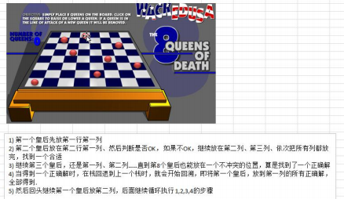
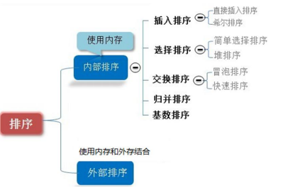
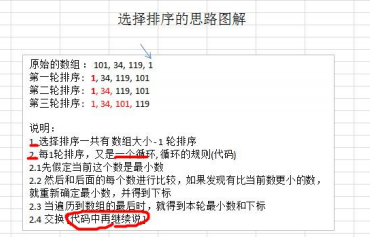
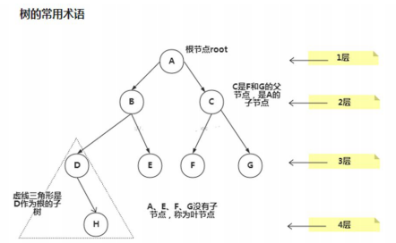
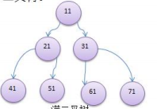
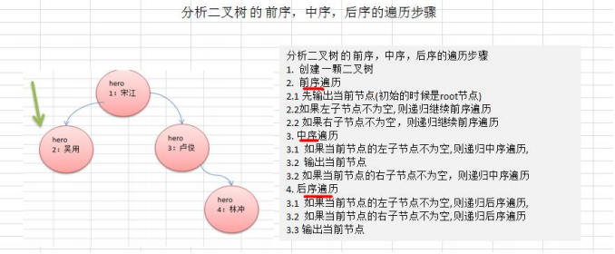
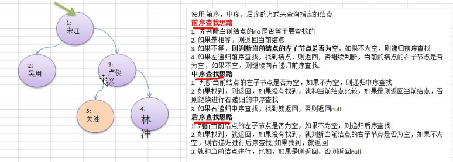
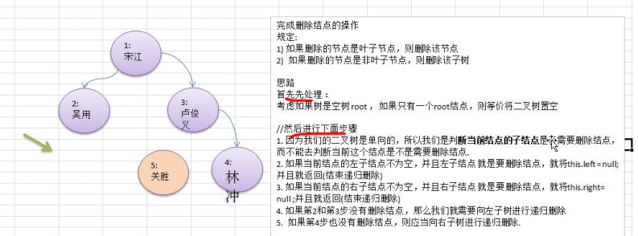

数据结构与算法分析-JAVA语言描述

数据结构与算法分析-JAVA语言描述 原书超清第3版 下载

> 链接：https://pan.baidu.com/s/1DPxP0EnufMc_8i75jfiJjA   提取码：jqh6
>
> 转自 [数据结构与算法分析Java语言描述 原书超清第3版 下载_gulang0309的专栏-CSDN博客_数据结构与算法分析java语言描述](https://blog.csdn.net/gulang0309/article/details/88657633)

## 1.引论

### 1.1递归

#### 1.1.1递归的四条基本法则

- **基准情形**：必须总要有某些基准情形，它无需递归就能解出。
- **不断推进**：对于那些需要递归求解的情形，每一次递归调用都必须要使状况朝向一种基准情形推进。
- **设计法则**：假设所有的递归调用都能运行。
- **合成效益法则**：在求解一个问题的同一实例时，切勿在不同的递归调用中做重复性的工作。

#### 1.1.2递归实例

**（1）使用递归实现依次打印一个整数的每一位**

```java
    public static void printDigit(int a){
        System.out.println(a);
    }
	public static void printOut(int n){
        if (n>=10) printOut(n/10);
        printDigit(n%10);
    }
```

​		以printOut（987）为例，判断987大于10，求printOut（98），判断98大于10，求printOut(9)，判断9不大于10，输出9之后printOut（9）结束返回printOut（98）输出8之后printOut（98）结束，返回printOut（987）输出7，执行完毕。

### 1.2泛型

## 2.算法分析

### 2.1时间频度

​	时间频度：一个算法花费的时间与算法中语句的执行次数成正比例，哪个算法中语句执行次数多，它花费时间就多。一个算法中的语句执行次数称为语句频度或时间频度。记为 T(n).

### 2.2时间复杂度

​	一般情况下，算法中的基本操作语句的重复执行次数是问题规模 n 的某个函数，用 T(n)表示，若有某个辅助函数 f(n)，使得当 n 趋近于无穷大时，T(n) / f(n) 的极限值为不等于零的常数，则称 f(n)是T(n)的同数量级函数。记作 T(n)=Ｏ( f(n) )，称Ｏ( f(n) ) 为算法的渐进时间复杂度，简称时间复杂度。 

​	 T(n) 不同，但时间复杂度可能相同。 如：T(n)=n²+7n+6 与 T(n)=3n²+2n+2 它们的 T(n) 不同，但时间复杂 度相同，都为 O(n²)。 

​	 计算时间复杂度的方法： 

- 用常数 1 代替运行时间中的所有加法常数 T(n)=n²+7n+6 => T(n)=n²+7n+1 

- 修改后的运行次数函数中，只保留最高阶项 T(n)=n²+7n+1 => T(n) = n² 

- 去除最高阶项的系数 

### 2.3常见的时间复杂度

**常数阶 O(1)**

无论代码执行了多少行，只要是没有循环等复杂结构，那这个代码的时间复杂度就都是O(1)


上述代码在执行的时候，它消耗的时候并不随着某个变量的增长而增长，那么无论这类代码有多长，即使有几万几十万行，都可以用O(1)来表示它的时间复杂度。

**对数阶 O(log2n)** 


说明：在while循环里面，每次都将 i 乘以 2，乘完之后，i 距离 n 就越来越近了。假设循环x次之后，i 就大于 2 了，此时这个循环就退出了，也就是说 2 的 x 次方等于 n，那么 x = log2n也就是说当循环 log2n 次以后，这个代码就结束了。因此这个代码的时间复杂度为：O(log2n)  。 O(log2n) 的这个2 时间上是根据代码变化的，i = i * 3 ，则是 O(log3n) .

**线性阶 O(n)**


说明：这段代码，for循环里面的代码会执行n遍，因此它消耗的时间是随着n的变化而变化的，因此这类代码都可以用O(n)来表示它的时间复杂度

**线性对数阶 O(nlog2n）**


说明：线性对数阶O(nlogN) 其实非常容易理解，将时间复杂度为O(logn)的代码循环N遍的话，那么它的时间复杂度就是 n * O(logN)，也就是了O(nlogN)

**平方阶 O(n^2)** 


说明：平方阶O(n²) 就更容易理解了，如果把 O(n) 的代码再嵌套循环一遍，它的时间复杂度就是 O(n²)，这段代码其实就是嵌套了2层n循环，它的时间复杂度就是 O(n*n)，即  O(n²) 如果将其中一层循环的n改成m，那它的时间复杂度就变成了 O(m*n)

**立方阶 O(n^3) ，k 次方阶 O(n^k) ，指数阶 O(2^n)**

说明：参考上面的O(n²) 去理解就好了，O(n³)相当于三层n循环，其它的类似

### 2.4平均时间复杂度和最坏时间复杂度

1) 平均时间复杂度是指所有可能的输入实例均以等概率出现的情况下，该算法的运行时间。
2) 最坏情况下的时间复杂度称最坏时间复杂度。一般讨论的时间复杂度均是最坏情况下的时间复杂度。这样做的
原因是：最坏情况下的时间复杂度是算法在任何输入实例上运行时间的界限，这就保证了算法的运行时间不会
比最坏情况更长。
3) 平均时间复杂度和最坏时间复杂度是否一致，和算法有关(如图:)。


### 2.5空间复杂度

​	类似于时间复杂度的讨论，一个算法的空间复杂度(Space Complexity)定义为该算法所耗费的存储空间，它也是 问题规模 n 的函数。

​	空间复杂度(Space Complexity)是对一个算法在运行过程中临时占用存储空间大小的量度。有的算法需要占用的 临时工作单元数与解决问题的规模 n 有关，它随着 n 的增大而增大，当 n 较大时，将占用较多的存储单元，例 如快速排序和归并排序算法, 基数排序就属于这种情况

​	在做算法分析时，主要讨论的是时间复杂度。从用户使用体验上看，更看重的程序执行的速度。一些缓存产品 (redis, memcache)和算法(基数排序)本质就是用空间换时间.

## 3.数据结构概述

### 3.1线性结构

​	<u>线性结构作为最常用的数据结构，其特点是数据元素之间存在一对一的线性关系</u> 

​	线性结构有两种不同的存储结构，即顺序存储结构(**数组**)和链式存储结构(**链表**)。顺序存储的线性表称为顺序表，顺序表中的存储元素是连续的；链式存储的线性表称为链表，链表中的存储元素不一定是连续的，元素节点中存放数据元素以及相邻元素的地址信息。

​	线性结构常见的有：**数组、队列、链表和栈**

### 3.2非线性结构

非线性结构包括：**二维数组，多维数组，广义表，树结构，图结**

## 4.稀疏数组和队列

### 4.1稀缺数组（SparseArray）

当一个数组中大部分元素为０，或者为同一个值的数组时，可以使用稀疏数组来保存该数组。 

稀疏数组的处理方法是: 

1) 记录数组一共有几行几列，有多少个不同的值 
2) 把具有不同值的元素的行列及值记录在一个小规模的数组中，从而缩小程序的规模


### 4.2队列

队列是一个有序列表，可以用数组或是链表来实现。 

遵循先入先出的原则。即：先存入队列的数据，要先取出。后存入的要后取出

### 4.2.1数组模拟队列

队列本身是有序列表，若使用数组的结构来存储队列的数据，则队列数组的声明如下图, 其中 maxSize 是该队列的最大容量。 

 因为队列的输出、输入是分别从前后端来处理，因此需要两个变量 front 及 rear 分别记录队列前后端的下标， front 会随着数据输出而改变，而 rear 则是随着数据输入而改变。


```java
class ArrayQueue{
    private int maxSize;    //队列的最大长度
    private int front;      //队列头下标，指向队列头的前一个位置，初始为-1
    private int rear;       //队列的尾下标，指向队列尾的数据，初始为-1
    private int arr[];      //存放数据，模拟队列
}
```

**问题分析**：目前数组使用一次就不能用， 没有达到复用。

**优化**：将这个数组使用算法，改进成一个环形的队列。

### 4.2.2数组模拟环形队列


```java
class CircleArrayQueue{
    private int maxSize;    //队列的最大长度，队列的有效长度为maxSize-1，空出一个空间
    private int front;      //队列头下标，指向队列的第一个数据，初始值为0
    private int rear;       //队列的尾下标，指向队列最后一个数据的后面一位，初始值为0
    private int arr[];      //存放数据，模拟队列
}
```

## 5.链表

### 5.1链表介绍

链表是有序的列表，但是它在内存中是存储如下


链表是以节点的方式来存储,是链式存储 

每个节点包含 data 域， next 域：指向下一个节点. 

如图：发现链表的各个节点不一定是连续存储.

链表分带头节点的链表和没有头节点的链表，根据实际的需求来确定

### 5.2单链表的应用实例

使用带 head 头的单向链表实现 –水浒英雄排行榜管理完成对英雄人物的增删改查操作

```java
//定义英雄节点
class HeroNode{
    public int no;          //编号
    public String name;     //名称
    public String nickName; //外号
    public HeroNode next;   //指向下一个节点的指针
}

//定义单链表
class SingleLinkedList{
    //初始化头节点
    private HeroNode head  = new HeroNode(0,"","");
}
```

#### 5.2.1增删改节点

- 添加节点


- 根据排名添加节点


- 删除和修改同理

#### 5.2.2复杂功能

- 求单链表中有效节点的个数

```java
    public int getLength(HeroNode head){
        int length =0;
        while (head.next!=null){
            length++;
            head = head.next;
        }
        return length;
    }
```

- 查找单链表中的倒数第 k 个结点

```java
//***使用快慢指针一次遍历实现查找链表的倒数第n个节点***
public HeroNode findLastIndexNode(HeroNode head,int n){
    if (head.next==null)
        throw new RuntimeException("链表为空!!!");
     HeroNode fast = head.next;
     HeroNode slow = head.next;
     while (fast.next!=null){
         //快指针先移动
         fast = fast.next;
         if (n!=1)
             n--;
         else
             //当快指针移动了n次时，代表快慢指针相隔n，慢指针可以开始移动，此时当快指针移动到链表的尾部时，慢指针指向的是链表倒数第n个节点
             slow = slow.next;
         //当快指针已经到达链表尾部时，快慢指针相隔任然小于n，说明n小于了链表的长度
         if (fast.next==null&&n>1)
             throw new RuntimeException("n大于了链表的长度!!!");
     }
     return slow;
}
```

- 单链表的反转


```java
//头插法实现链表的逆转
public void reversetList(HeroNode head){
    if (head.next==null||head.next.next==null)
        throw new RuntimeException("链表为空!!!");
    //将原来链表上面的节点依次插到该链表后
    HeroNode revHead = new HeroNode(0, "", "");
    HeroNode temp;
    while (head.next!=null){
        temp = head.next.next;          //temp用来保存与那链表的第二个节点，以防止数据丢失
        head.next.next=revHead.next;    //将原链表的第一个节点的next指向反转链表的第一个节点
        revHead.next = head.next;       //将反转链表的头结点的next指向原链表的第一个节点
        head.next = temp;               //原链表的第一个节点此时已经转移为了反转链表的第一个节点，将原链表的第二个节点作为原链表的第一个节点
    }
    //此处不能head = revHead 因为函数结束之后，revHead作为局部变量会失效
    head.next = revHead.next;
}
```

- 从尾到头打印单链表 

```java
//递归实现逆序打印链表内容
public void reversePrint1(HeroNode head){
    if(head.next == null) {
        return;//空链表，不能打印
    }
    //当head.next指向链表尾节点时递归结束
    if (head.next.next==null)
        System.out.println(head.next);
    else{
        reversePrint1(head.next);
        System.out.println(head.next);
    }
}

//使用栈Stack逆序打印链表内容
public void reversePrint2(HeroNode head){
    if(head.next == null) {
        return;//空链表，不能打印
    }
    //创建要给一个栈，将各个节点压入栈
    Stack<HeroNode> stack = new Stack<HeroNode>();
    HeroNode cur = head.next;
    //将链表的所有节点压入栈
    while(cur != null) {
        stack.push(cur);
        cur = cur.next; //cur 后移，这样就可以压入下一个节点
    }
    //将栈中的节点进行打印,pop 出栈
    while (stack.size() > 0) {
        System.out.println(stack.pop()); //stack 的特点是先进后出
    }
}
```

### 5.3双向链表

**单向链表的缺点分析**: 

- 单向链表，查找的方向只能是一个方向，而双向链表可以向前或者向后查找。 
- 单向链表不能自我删除，需要靠辅助节点 ，而双向链表，则可以自我删除，所以前面我们单链表删除 时节点，总是找到 temp,temp 是待删除节点的前一个节点(认真体会）

**代码实现**

```java
class HeroNode2 {
public int no;
public String name;
public String nickname;
public HeroNode2 next; // 指向下一个节点, 默认为 null
public HeroNode2 pre; // 指向前一个节点, 默认为 null
}
```

### 5.4环形链表-约瑟夫问题

#### 5.4.1约瑟夫问题

Josephu(约瑟夫、约瑟夫环) 问题为：设编号为 1，2，… n 的 n 个人围坐一圈，约定编号为 k（1<=k<=n）的人从 1 开始报数，数 到 m 的那个人出列，它的下一位又从 1 开始报数，数到 m 的那个人又出列，依次类推，直到所有人出列为止，由 此产生一个出队编号的序列。

#### 5.4.2解决思路

用一个不带头结点的循环链表来处理 Josephu 问题：先构成一个有 n 个结点的单循环链表，然后由 k 结点起从 1 开 始计数，计到 m 时，对应结点从链表中删除，然后再从被删除结点的下一个结点又从 1 开始计数，直到最后一个 尚硅谷 Java 数据结构和算法 更多 Java –大数据 –前端 –python 人工智能 -区块链资料下载，可访问百度：尚硅谷官网 第 55页 结点从链表中删除算法结束。


#### 5.4.3代码实现

```java
// 创建一个 Boy 类，表示一个节点
class Boy {
    private int no;// 编号
    private Boy next; // 指向下一个节点,默认 null
}
// 根据用户的输入，计算出小孩出圈的顺序
/**
     *
     * @param startNo
     * 表示从第几个小孩开始数数
     * @param countNum
     * 表示数几下
     * @param nums
     * 表示最初有多少小孩在圈中
     */
public void countBoy(int startNo, int countNum, int nums) {

    if (nums<1||countNum<1||first==null||startNo<1||startNo>nums)
        throw new RuntimeException("参数有误，从新输入！！");
    //创建辅助指针，指向环形链表的最后一个节点
    Boy helper = first;
    while (helper.getNext()!=first){
        helper = helper.getNext();
    }
    //移动helper和first，使从第startNo个小孩开始数
    for (int i=0;i<(startNo-1);i++){
        helper = helper.getNext();
        first = first.getNext();
    }
    //开始数数，出圈
    while (helper!=first){
        //报数
        for (int i=0;i<(countNum-1);i++){
            helper = helper.getNext();
            first = first.getNext();
        }
        System.out.println("小孩"+ first.getNo() +"出队列：" );
        first = first.getNext();
        helper.setNext(first);

    }
    System.out.println("最后的小孩："+ first.getNo());
}
```

## 6.栈

### 6.1栈的介绍

- 栈的英文为(stack) 
- 栈是一个先入后出(FILO-First In Last Out)的有序列表。
- 栈(stack)是限制线性表中元素的插入和删除只能在线性表的同一端进行的一种特殊线性表。允许插入和删除的 一端，为变化的一端，称为栈顶(Top)，另一端为固定的一端，称为栈底(Bottom)。
- 根据栈的定义可知，最先放入栈中元素在栈底，最后放入的元素在栈顶，而删除元素刚好相反，最后放入的元 素最先删除，最先放入的元素最后删除 
- 图解方式说明出栈(pop)和入栈(push)的概念


**应用场景**

1) 子程序的调用：在跳往子程序前，会先将下个指令的地址存到堆栈中，直到子程序执行完后再将地址取出，以回到原来的程序中。 
2) 处理递归调用：和子程序的调用类似，只是除了储存下一个指令的地址外，也将参数、区域变量等数据存入堆栈中。 
3) 表达式的转换[中缀表达式转后缀表达式]与求值(实际解决)。
4) 二叉树的遍历。 
5) 图形的深度优(depth 一 first)搜索法。

### 6.2数组实现栈

##### 

```java
class ArrayStack{
    private int maxSize;
    private int[] stack;
    private int top;
    public ArrayStack(int maxSize) {
        this.maxSize = maxSize;
        stack = new int[maxSize];
        top = -1;
    }
    public boolean isFull(){return top==maxSize-1;}
    public boolean isEmpty(){return top ==-1;}
    //入栈
    public void push(int value){
        if (isFull())
            throw new RuntimeException("栈满！！！");
        top++;
        stack[top] = value;
    }
    //出栈
    public int pop(){
        if (isEmpty())
            throw new RuntimeException("栈空！！！");
        top--;
        return stack[top+1];
    }
    //从栈顶开始输出栈内的数据
    public void list(){
        for (int i=top;i>=0;i--)
            System.out.printf("stack[%d]=%d\n", i, stack[i]);
    }
}
```

### 6.3栈实现综合计算器(中缀表达式)

.png)

**具体代码见 package com.yue.stack.Calculator**

### 6.4前后中缀表达式

- 前缀、中缀、后缀表达式是对表达式的不同记法，其区别在于**运算符相对于操作数的位置不同**，前缀表达式的运算符位于操作数之前，中缀和后缀同理
  - 中缀表达式：1 + (2 + 3) × 4 - 5
  - 前缀表达式：- + 1 × + 2 3 4 5
  - 后缀表达式：1 2 3 + 4 × + 5 -

**前缀表达式**

- 中缀表达式是一种通用的算术或逻辑公式表示方法，操作符以中缀形式处于操作数的中间。中缀表达式是人们常用的算术表示方法。
- 虽然人的大脑很容易理解与分析中缀表达式，但对计算机来说中缀表达式却是很复杂的，因此计算表达式的值时，通常需要先将中缀表达式转换为前缀或后缀表达式，然后再进行求值。**对计算机来说，计算前缀或后缀表达式的值非常简单**。

#### 6.4.1中缀表达式转化为前缀和后缀表达式

1. 按照运算符的优先级对所有的运算单位加括号
2. 将运算符移动到对应括号的前面（前缀表达式）或后面（后缀表达式）
3. 去掉括号，得到前缀或后缀表达式

示例：中缀表达式：1+(2+3)×4-5

1）**加括号**
	式子变成 ((1+((2+3)×4))-5)

2）**移动运算符**

​	对于前缀表达式，变成了 -(+(1×(+(23)4))5)

​	对于后缀表达式：变成了((1((23)+4)×)+5)-

3）**去掉括号**
	前缀表达式： - + 1 × + 2 3 4 5
	后缀表达式：1 2 3 + 4 × + 5 -

### 6.5 逆波兰计算器 

我们完成一个逆波兰计算器，要求完成如下任务: 

- 输入一个逆波兰表达式(后缀表达式)，使用栈(Stack), 计算其结果 
- 支持小括号和多位数整数，因为这里我们主要讲的是数据结构，因此计算器进行简化，只支持对整数的计算。

```java
//完成对逆波兰表达式的运算
/*
1)从左至右扫描，将 3 和 4 压入堆栈；
2)遇到+运算符，因此弹出 4 和 3（4 为栈顶元素，3 为次顶元素），计算出 3+4 的值，得 7，再将 7 入栈；
3)将 5 入栈；
4)接下来是×运算符，因此弹出 5 和 7，计算出 7×5=35，将 35 入栈；
5)将 6 入栈；
6)最后是-运算符，计算出 35-6 的值，即 29，由此得出最终结果
*/
public static int calculate(List<String> ls){
    Stack<String> stack = new Stack();
    for (String item:ls){
        if (item.matches("\\d+")){//使用正则表达式来匹配字符串是否是多位数
            stack.push(item);
        }else {
            //假如不是的话就pop出两个数进行运算，将结果再入栈
            int num2 = Integer.parseInt(stack.pop());
            int num1 = Integer.parseInt(stack.pop());
            int res = 0;
            if (item.equals("+")) {
                res = num1 + num2;
            } else if (item.equals("-")) {
                res = num1 - num2;
            } else if (item.equals("*")) {
                res = num1 * num2;
            } else if (item.equals("/")) {
                res = num1 / num2;
            } else {
                throw new RuntimeException("运算符有误");
            }
            //把 res 入栈
            stack.push("" + res);
        }
    }
    return Integer.parseInt(stack.pop());
}
```

### 6.6 中缀表达式转换为后缀表达式

1) 初始化两个栈：运算符栈 s1 和储存中间结果的栈 s2； 

2) 从左至右扫描中缀表达式； 

3) 遇到操作数时，将其压 s2； 

4) 遇到运算符时，比较其与 s1 栈顶运算符的优先级： 

   ①.如果 s1 为空，或栈顶运算符为左括号“(”，则直接将此运算符入栈； 

   ②.否则，若优先级比栈顶运算符的高，也将运算符压入 s1； 

   ③.否则，将 s1 栈顶的运算符弹出并压入到 s2 中，再次转到(4-1)与 s1 中新的栈顶运算符相比较；

   （弹出优先级大于等于自己的运算符号，直到遇到‘）’或者栈空）

5) 遇到括号时：

   ① 如果是左括号“(”，则直接压入 s1 

   ② 如果是右括号“)”，则依次弹出 s1 栈顶的运算符，并压入 s2，直到遇到左括号为止，此时将这一对括号丢弃 

6) 重复步骤 2 至 5，直到表达式的最右边

7) 将 s1 中剩余的运算符依次弹出并压入 s2 

8) 依次弹出 s2 中的元素并输出，结果的逆序即为中缀表达式对应的后缀表达式


```java
//即 ArrayList [1,+,(,(,2,+,3,),*,4,),-,5] =》 ArrayList [1,2,3,+,4,*,+,5,–]
//方法：将得到的中缀表达式对应的 List => 后缀表达式对应的 List
public static List<String> parseSuffixExpreesionList(List<String> ls) {
    //定义两个栈
    Stack<String> s1 = new Stack<String>(); // 符号栈
    //说明：因为 s2 这个栈，在整个转换过程中，没有 pop 操作，而且后面我们还需要逆序输出
    //因此比较麻烦，这里我们就不用 Stack<String> 直接使用 List<String> s2
    //Stack<String> s2 = new Stack<String>(); // 储存中间结果的栈 s2
    List<String> s2 = new ArrayList<String>(); // 储存中间结果的 Lists2
    //遍历 ls
    for(String item: ls) {
        //如果是一个数，加入 s2
        if(item.matches("\\d+")) {
            s2.add(item);
        } else if (item.equals("(")) {
            s1.push(item);
        } else if (item.equals(")")) {
            //如果是右括号“)”，则依次弹出 s1 栈顶的运算符，并压入 s2，直到遇到左括号为止，此时将这一对括号丢弃
            while(!s1.peek().equals("(")) {
                s2.add(s1.pop());
            }
            s1.pop();//!!! 将 ( 弹出 s1 栈， 消除小括号
        } else {
            //当 item 的优先级小于等于 s1 栈顶运算符, 将 s1 栈顶的运算符弹出并加入到 s2 中，再次转到(4.1)与 s1 中新的栈顶运算符相比较
            //问题：我们缺少一个比较优先级高低的方法
            while(s1.size() != 0 && Operation.getValue(s1.peek()) >= Operation.getValue(item) ) {
                s2.add(s1.pop());
            }
            //还需要将 item 压入栈
            s1.push(item);
        }
    }
    //将 s1 中剩余的运算符依次弹出并加入 s2
    while(s1.size() != 0) {
        s2.add(s1.pop());
    }
    return s2; //注意因为是存放到 List, 因此按顺序输出就是对应的后缀表达式对应的 List
}
```

## 7.递归

**递归应用场景**

- 各种数学问题如: 8 皇后问题 , 汉诺塔, 阶乘问题, 迷宫问题, 球和篮子的问题(google 编程大赛) 
- 各种算法中也会使用到递归，比如快排，归并排序，二分查找，分治算法等. 
- 将用栈解决的问题-->第归代码比较简洁

**递归遵守的重要规则**

- 执行一个方法时，就创建一个新的受保护的独立空间(栈空间)
- 方法的局部变量是独立的，不会相互影响, 比如 n 变量
- 如果方法中使用的是引用类型变量(比如数组)，就会共享该引用类型的数据.
- 递归必须向退出递归的条件逼近，否则就是无限递归,出现 StackOverflowError，死龟了:)
- 当一个方法执行完毕，或者遇到 return，就会返回，遵守谁调用，就将结果返回给谁，同时当方法执行完毕或 者返回时，该方法也就执行完毕

### 7.1迷宫问题

使用**递归回溯**来给小球找路 

1. map 表示地图 
2. i,j 表示从地图的哪个位置开始出发 (1,1)
3. 如果小球能到 map[6][5] 位置，则说明通路找到.
4. 约定： 当 map[i][j] 为 0 表示该点没有走过 当为1 表示墙 ；2 表示通路可以走 ；3 表示该点已经走过，但是走不通 
5. 在走迷宫时，需要确定一个策略(方法) 下->右->上->左 , 如果该点走不通，再回溯

```java
/**
 * @param map 表示地图
 * @param i 从哪个位置开始找
 * @param j
 * @return 如果找到通路，就返回 true, 否则返回 false
 */
public static boolean setWay(int[][] map, int i,int j){
    if (map[6][5]==2)   return true;
    if (map[i][j]==0){
        map[i][j]=2;    //假定该点可以走通
        if (setWay(map,i+1,j)) return true;
        else if (setWay(map, i, j+1)) return true;
        else if (setWay(map, i-1, j)) return true;
        else if (setWay(map, i, j-1)) return true;
        else {
            map[i][j]=3;
            return false;
        }
    }else return false;
}
```

### 7.2八皇后问题

- 八皇后问题，是一个古老而著名的问题，是回溯算法的典型案例。该问题是国际西洋棋棋手马克斯·贝瑟尔于 1848 年提出：在 8×8 格的国际象棋上摆放八个皇后，使其不能互相攻击，即：任意两个皇后都不能处于同一行、 同一列或同一斜线上，问有多少种摆法(92)。



```java
	//定义一个 max 表示共有多少个皇后
    int max = 8;
    //定义数组 array, 保存皇后放置位置的结果,比如 arr = {0 , 4, 7, 5, 2, 6, 1, 3}
    int[] arr = new int[max];
//防入第n个皇后
public void check(int n){
    if (n==max) {
        System.out.println(Arrays.toString(arr));
        return;
    }
    //依次放入皇后
    for (int i=0;i<max;i++){
        arr[n]=i;
        if (judge(n)) {//当判断当前皇后与前面的不冲突时，递归到下一层中，开始放下一个皇后
            arr[n]=i;
            check(n+1);
        }
        //当这一层的八个位置放皇后都冲突时，回溯到上一层的for循环中，移动上一个皇后
    }
}
//判断第n个皇后摆放的位置与前面的是否冲突，冲突返回false，不冲突返回true
public boolean judge(int n){
    for (int i=0;i<n;i++){
        //判断与之前的皇后是否冲突
        //Math.abs(n-i)==Math.abs(arr[n]-arr[i])
        //当y-y = x-x时说明为等腰三角形，在同一斜线上
        if (arr[n]==arr[i]||Math.abs(n-i)==Math.abs(arr[n]-arr[i])) 
            return false;
    }
    return true;
}
```

## 8.排序算法

### 8.1排序算法介绍

- 内部排序: 指将需要处理的所有数据都加载到内部存储器(内存)中进行排序。 
- 外部排序法： 数据量过大，无法全部加载到内存中，需要借助外部存储(文件等)进行排序。



### 8.2冒泡排序

**冒泡排序**（Bubble Sorting）的基本思想是：通过对待排序序列从前向后（从下标较小的元素开始）,依次比较 相邻元素的值，若发现逆序则交换，使值较大的元素逐渐从前移向后部，就像水底下的气泡一样逐渐向上冒。 

- 优化： 因为排序的过程中，各元素不断接近自己的位置，如果一趟比较下来没有进行过交换，就说明序列有序，因此要在 排序过程中设置一个标志 flag 判断元素是否进行过交换。从而减少不必要的比较。


```java
//冒泡排序
public class BubbleSort {
    public static void main(String[] args) {
        int arr[]={3,9,-1,10,2};
        //提前将len储存好，防止每次for循环都要计算length浪费时间，使用空间换时间
        int len = arr.length;
        //标志位，优化冒泡排序
        boolean flag = false;

        //一共需要冒泡len-1次即可完成排序
        for(int i=0;i<len-1;i++){
            //因为上一次冒泡已经将前i为都固定到了正确的位置上，只需要将泡冒到len-1的位置即可
            for (int j=0;j<len-i-1;j++){
                if (arr[j]>arr[j+1]){
                    int temp = arr[j+1];
                    arr[j+1] = arr[j];
                    arr[j] = temp;
                    flag=true;
                }
            }
            //如果这一趟冒泡中没有发生位置交换，说明此时数组已经排序完成，退出循环即可
            if (!flag) break;
            flag = false;
            System.out.println(Arrays.toString(arr));
        }
    }
}
```

### 8.3选择排序

**选择排序**（select sorting）也是一种简单的排序方法。它的基本思想是：第一次从 arr[0]~arr[n-1]中选取最小值， 与 arr[0]交换，第二次从 arr[1]~arr[n-1]中选取最小值，与 arr[1]交换，第三次从 arr[2]~arr[n-1]中选取最小值，与 arr[2] 交换，…，第 i 次从 arr[i-1]~arr[n-1]中选取最小值，与 arr[i-1]交换，…, 第 n-1 次从 arr[n-2]~arr[n-1]中选取最小值， 与 arr[n-2]交换，总共通过 n-1 次，得到一个按排序码从小到大排列的有序序列



```java
public class SelectSort {
    public static void main(String[] args) {
        int arr[]={3,9,-1,10,2};
        //提前将len储存好，防止每次for循环都要计算length浪费时间，使用空间换时间
        int len = arr.length;
        //选择len-1次即可完成排序
        for (int i=0;i<len-1;i++){
            //假如第i个为最大
            int maxIndex = i;
            //将arr[i]与后面的数据依次比较，寻找最小的值的下标
            for (int j=i;j<len;j++)
                if (arr[maxIndex]<arr[j])
                    maxIndex=j;
                //将最小值与第i个值交换位置
            int temp = arr[i];
            arr[i] = arr[maxIndex];
            arr[maxIndex] = temp;
        }
        System.out.println(Arrays.toString(arr));
    }
}
```

### 8.4插入排序

**插入排序**（Insertion Sorting）的基本思想是：把 n 个待排序的元素看成为一个有序表和一个无序表，开始时有 序表中只包含一个元素，无序表中包含有 n-1 个元素，排序过程中每次从无序表中取出第一个元素，把它的排 序码依次与有序表元素的排序码进行比较，将它插入到有序表中的适当位置，使之成为新的有序表。


```java
public class InsertSort {
    public static void main(String[] args) {
        int arr[]={3,9,4,5,-2};
        //提前将len储存好，防止每次for循环都要计算length浪费时间，使用空间换时间
        int len = arr.length;

        //第一位只有一位数字，默认为其有序，从第二位开始
        for (int i=1;i<len;i++){
            int temp = arr[i];  //防止后面数组后移时数据丢失，提前创建中间变量储存数组
            int inserIndex = i-1;  //存放要插入的位置下标

            //在前面的有序部分寻找插入位置
            //insertIndex>=0让数组不越界，当inserIndex=-1时说名要将temp插入到0下标位置
            while(inserIndex>=0&&temp<arr[inserIndex]){
                arr[inserIndex+1] = arr[inserIndex];//将数组后移，腾出插入位置
                inserIndex--;
            }
            arr[inserIndex+1] = temp;
        }
        System.out.println(Arrays.toString(arr));
    }
}
```

### 8.4希尔排序

- 希尔排序是希尔（Donald Shell）于 1959 年提出的一种排序算法。希尔排序也是一种插入排序，它是简单插入排序经过改进之后的一个更高效的版本，也称为缩小增量排序。

- 希尔排序是把记录按下标的一定增量分组，对每组使用直接插入排序算法排序；随着增量逐渐减少，每组包含 的关键词越来越多，当增量减至 1 时，整个文件恰被分成一组，算法便终止

  

```Java
//增强冒泡
public static void shellSort(int[] arr) {
    for (int gap = arr.length / 2; gap > 0; gap /= 2) {
        for (int i = gap; i < arr.length; i++) {
                // 遍历各组中所有的元素(共 gap 组，每组有个元素), 步长 gap
            for (int j = i - gap; j >= 0; j -= gap) {//每一组使用冒泡排序
                // 如果当前元素大于加上步长后的那个元素，说明交换
                if (arr[j] > arr[j + gap]) {
                    int temp = arr[j];
                    arr[j] = arr[j + gap];
                    arr[j + gap] = temp;
                }
            }
        }
    }
}
//增强插入
public static void shellSort2(int[] arr){
    //提前将len储存好，防止每次for循环都要计算length浪费时间，使用空间换时间
    int len = arr.length;
    //gap表示分组的数目
    for (int gap = len/2;gap>0;gap/=2)
        for (int i = gap; i< len; i++){
                int temp = arr[i];
                int j = i;
                while (j-gap>=0&&temp<arr[j-gap]){
                    arr[j] = arr[j-gap];
                    j = j-gap;
                }
                arr[j] = temp;
            }
        }
}
```

### 8.5快速排序

- 快速排序（Quicksort）是对冒泡排序的一种改进。基本思想是：通过一趟排序将要排序的数据分割成独立的两 部分，其中一部分的所有数据都比另外一部分的所有数据都要小，然后再按此方法对这两部分数据分别进行快速排 序，整个排序过程可以递归进行，以此达到整个数据变成有序序列


```java
//快速排序
public static void quickSort(int[] arr,int l,int r){
    if (l>=r) return;    //如果数组只有一个数字则退出函数
    int left=l,right=r;
    int pivot = arr[left];  //选择最左边的数字作为中介值
    while (left<right){
        //将右指针逐步向左移动，直到寻找到比中介值小的值，或者右指针移动到和左指针相同
        while (left<right&&arr[right]>=pivot) {
            right--;    //移动指针
        }
        if (left<right)
            arr[left]=arr[right];   //将右指针的值移动到做指针上

        //开始移动左指针，寻找比中介值大的值
        while (left<right&&arr[left]<=pivot){
            left++;     //移动指针
        }
        if (left<right)
            arr[right] = arr[left]; //将左指针的值赋给右指针
    }

    arr[left] = pivot;  //将中介值放到合适的位置
    //System.out.println(Arrays.toString(arr)+"left:"+left+"right:"+right);
    quickSort(arr, l, left-1);  //将中介值左边的部分递归这一过程，由于中介值已经在正确的位置上面了，所以不需要使用left，而是使用left-1，+1
    quickSort(arr, left+1, r);  //将中介值右边的部分递归这一过程
}
```


## 9.查找算法

## 10.哈希表

## 11.树结构

### 11.1为什么需要树这种数据结构

1) 数组存储方式的分析 优点：通过下标方式访问元素，速度快。对于有序数组，还可使用二分查找提高检索速度。 缺点：如果要检索具体某个值，或者插入值(按一定顺序)会整体移动，效率较低


2) 链式存储方式的分析 优点：在一定程度上对数组存储方式有优化(比如：插入一个数值节点，只需要将插入节点，链接到链表中即可， 删除效率也很好)。 缺点：在进行检索时，效率仍然较低，比如(检索某个值，需要从头节点开始遍历) 


3) 树存储方式的分析 能提高数据存储，读取的效率, 比如利用 二叉排序树(Binary Sort Tree)，既可以保证数据的检索速度，同时也 可以保证数据的插入，删除，修改的速度。


### 11.2树的常用术语

树的常用术语(结合示意图理解): 

- 节点 
- 根节点
- 父节点 
- 子节点 
- 叶子节点 (没有子节点的节点)
- 节点的权(节点值) 
- 路径(从 root 节点找到该节点的路线) 
- 层 
- 子树
- 树的高度(最大层数) 
- 森林 :多颗子树构成森林



### 11.3二叉树

- 树有很多种，每个节点最多只能有两个子节点的一种形式称为二叉树。 

- 二叉树的子节点分为左节点和右节点


- 如果该二叉树的所有叶子节点都在最后一层，并且结点总数= 2^n -1 , n 为层数，则我们称为**满二叉树**



- 如果该二叉树的所有叶子节点都在最后一层或者倒数第二层，而且最后一层的叶子节点在左边连续，倒数第二 层的叶子节点在右边连续，我们称为**完全二叉树**


#### 11.3.2二叉树-遍历

前序遍历: 先输出父节点，再遍历左子树和右子树 

中序遍历: 先遍历左子树，再输出父节点，再遍历右子树 

后序遍历: 先遍历左子树，再遍历右子树，最后输出父节点



```java
//树的节点
class HeroNode{
    private int no;
    private String name;
    private HeroNode left;  //左右节点
    private HeroNode right;
}
//前序遍历
public void preOrder(HeroNode node){
    if (node == null) throw new RuntimeException("树为空！！！");
    System.out.println(node.getNo());
    if (node.getLeft()!=null) preOrder(node.getLeft());
    if (node.getRight()!=null) preOrder(node.getRight());
}
//中序遍历
public void infixOrder(HeroNode node){
    if (node == null) throw new RuntimeException("树为空！！！");
    if (node.getLeft()!=null) infixOrder(node.getLeft());
    System.out.println(node.getNo());
    if (node.getRight()!=null) infixOrder(node.getRight());
}
//后序遍历
public void postOrder(HeroNode node){
    if (node == null) throw new RuntimeException("树为空！！！");
    if (node.getLeft()!=null) postOrder(node.getLeft());
    if (node.getRight()!=null) postOrder(node.getRight());
    System.out.println(node.getNo());
}
```

#### 11.3.3二叉树-查找指定节点




```java
//前序遍历查找
public HeroNode preOrderSearch(HeroNode node,int no){
    if (node == null) throw new RuntimeException("树为空！！！");
    HeroNode resNode = null;    //假如查找到节点就放到resNode中，以方便判断递归的停止
    if (node.getNo()==no) return node;
    if (node.getLeft()!=null) resNode = preOrderSearch(node.getLeft(),no);
    if (resNode!=null) return resNode;  //在左分支上面查找到结果的话就结束递归，不在进入右分支
    if (node.getRight()!=null)resNode = preOrderSearch(node.getRight(),no);
    if (resNode!=null) return resNode;
    return null;
}
```


#### 11.3.4二叉树-删除指定节点



```java
//Tree
public void delNode(int no){
    if (root == null) throw new RuntimeException("树为空！！！");
    if (root.getNo() == no) root=null;
    else root.delNode(no);
}
//Node
public void delNode(int no){
    if (this.left!=null){
        if (this.left.getNo()==no){
            this.left=null;
        }else
            this.left.delNode(no);
    }
    if (this.right!=null){
        if (this.right.getNo()==no){
            this.right=null;
        }else
            this.right.delNode(no);
    }

}
```

## 12.树结构的实际应用

## 13.多路查找树

## 14.图

图是一种数据结构，其中结点可以具有零个或多个相邻元素。两个结点之间的连接称为边。 结点也可以称为 顶点。

### 14.1图的常用概念

顶点(vertex)  边(edge)   路径  无向图


### 14.2图的表示方式

**邻接矩阵**

- 邻接矩阵是表示图形中顶点之间相邻关系的矩阵，对于 n 个顶点的图而言，矩阵是的 row 和 col 表示的是 1....n 个点。


**邻接表**

- 邻接矩阵需要为每个顶点都分配 n 个边的空间，其实有很多边都是不存在,会造成空间的一定损失. 

- 邻接表的实现只关心存在


**常用功能代码实现**

```java
public class Graph {
    //构造器，vertexNum顶点个数
    public Graph(int vertexNum){
        vertexList = new ArrayList<>(vertexNum);
        edges = new int[vertexNum][vertexNum];
        numOfEdges = 0;
    }

    private ArrayList<String> vertexList;   //存储顶点集合
    private int[][] edges;  //存储图对应的邻接矩阵
    private int numOfEdges; //存放边的数目

    //定义给数组 boolean[], 记录某个结点是否被访问
    private boolean[] isVisited;

    //获取顶点个数
    public int getNumOfVertex(){
        return vertexList.size();
    }
    //显示图对应的邻接矩阵
    public void showGraph(){
        System.out.println(Arrays.deepToString(edges));
    }
    //获得边的个数
    public int getNumOfEdges() {
        return numOfEdges;
    }
    //返回结点 i(下标)对应的数据 0->"A" 1->"B" 2->"C"
    public String getValueByIndex(int i) {
        return vertexList.get(i);
    }
    //返回v1和v2的权值
    public int getWeight(int v1,int v2){
        return edges[v1][v2];
    }
    //添加结点
    public void insertVertex(String vertex){
        vertexList.add(vertex);
    }
    //添加边
    // @param v1 表示点的下标即使第几个顶点 "A"-"B" "A"->0 "B"->1
    //* @param v2 第二个顶点对应的下标
    //* @param weight 表示
    public void insertEdge(int v1,int v2,int weight){
        edges[v1][v2] = weight;
        edges[v2][v1] = weight;
        numOfEdges++;
    }
    
}
```

**创建图**

```java
public static void main(String[] args) {
    int n = 5; //结点的个数
    String Vertexs[] = {"A", "B", "C", "D", "E"};
    //String Vertexs[] = {"1", "2", "3", "4", "5", "6", "7", "8"}
    Graph graph = new Graph(n);
    for(String vertex: Vertexs) {
        graph.insertVertex(vertex);
    }
    //添加边 A-B A-C B-C B-D B-E
    graph.insertEdge(0, 1, 1); // A-B
    graph.insertEdge(0, 2, 1); //
    graph.insertEdge(1, 2, 1); //
    graph.insertEdge(1, 3, 1); //
    graph.insertEdge(1, 4, 1); //
    graph.showGraph();
}
```

### 14.3图的深度遍历


### 14.4图的广度遍历

## 程序员常用算法

### 动态规划

1) 动态规划(Dynamic Programming)算法的核心思想是：将大问题划分为小问题进行解决，从而一步步获取最优解 的处理算法 

2) 动态规划算法与分治算法类似，其基本思想也是将待求解问题分解成若干个子问题，先求解子问题，然后从这 些子问题的解得到原问题的解。 

3) 与分治法不同的是，适合于用动态规划求解的问题，经分解得到子问题往往不是互相独立的。 ( 即下一个子 阶段的求解是建立在上一个子阶段的解的基础上，进行进一步的求解

4) 动态规划可以通过填表的方式来逐步推进，得到最优解.

   #### 背包问题

   背包问题：有一个背包，容量为 4 磅 ， 现有如下物品

   | 物品 | 重量 | 价格 |
   | ---- | ---- | ---- |
   | 吉他 | 1    | 1500 |
   | 音响 | 4    | 3000 |
   | 电脑 | 3    | 2000 |

   1. 要求达到的目标为装入的背包的总价值最大，并且重量不超出

   2. 要求装入的物品不能重复 

   3. 背包问题主要是指一个给定容量的背包、若干具有一定价值和重量的物品，如何选择物品放入背包使物品的价 值最大。其中又分 01 背包和完全背包(完全背包指的是：每种物品都有无限件可用) 

   4. 这里的问题属于 01 背包，即每个物品最多放一个。而无限背包可以转化为 01 背包。 

   5. 算法的主要思想，利用动态规划来解决。每次遍历到的第 i 个物品，根据 w[i]和 v[i]来确定是否需要将该物品 放入背包中。即对于给定的 n 个物品，设 v[i]、w[i]分别为第 i 个物品的价值和重量，C 为背包的容量。再令 v[i][j] 表示在前 i 个物品中能够装入容量为 j 的背包中的最大价值。则我们有下面的结果：

      (1) v[i][0]=v[0][j]=0; //表示 填入表 第一行和第一列是 0

      (2) 当 w[i]> j 时：v[i][j]=v[i-1][j] // 当准备加入新增的商品的容量大于 当前背包的容量时，就直接使用上一个 单元格的装入策略 

      (3) 当 j>=w[i]时： v[i][j]=max{v[i-1][j], v[i]+v[i-1][j-w[i]]} 

      // 当 准备加入的新增的商品的容量小于等于当前背包的容量, 

      // 装入的方式:

      ​	 v[i-1][j]： 就是上一个单元格的装入的最大值 

      ​	v[i] : 表示当前商品的价值 

      ​	v[i-1][j-w[i]] ： 装入 i-1 商品，到剩余空间 j-w[i]的最大值 

      ​	当 j>=w[i]时： v[i][j]=max{v[i-1][j], v[i]+v[i-1][j-w[i]]} 

   

```java
//动态规划解决背包问题
public class KnapsackProblem {
    public static void main(String[] args) {
        int[] w = {1, 4, 3};//物品的重量
        int[] val = {1500, 3000, 2000}; //物品的价值 这里 val[i] 就是前面讲的 v[i]
        int m = 4; //背包的容量
        int n = val.length;//物品的个数

        //创建二维数组，
        //v[i][j] 表示在前 i 个物品中能够装入容量为 j 的背包中的最大价值
        int[][] v = new int[n+1][m+1];

        //为了记录放入商品的情况，我们定一个二维数组
        int[][] path =new int[n+1][m+1];

        //处理第一行，第一列都设置为0
        for(int i=0;i<v.length;i++) v[i][0]=0;
        for(int i=0;i<v[0].length;i++) v[0][i]=0;

        //当 w[i]> j 时：v[i][j]=v[i-1][j] //当准备加入新增的商品的容量大于当前背包的容量时，就直接使用上一个单元格的装入策略
        //当 j>=w[i]时： v[i][j]=max{v[i-1][j], val[i]+v[i-1][j-w[i]]}
        //j是横行，i是竖行(i-1表示当前是哪个商品)
        for (int i =1;i<v.length;i++){
            for (int j=1;j<v[0].length;j++){
                if (w[i-1]>j) v[i][j]=v[i-1][j];
                else v[i][j]=Math.max(v[i-1][j],val[i-1]+v[i-1][j-w[i-1]]);
            }
        }
        //输出一下 v 看看目前的情况
        for(int i =0; i < v.length;i++) {
            for(int j = 0; j < v[i].length;j++) {
                System.out.print(v[i][j] + " ");
            }
            System.out.println();
        }
    }
}
```

### 贪心算法

- 贪婪算法(贪心算法)是指在对问题进行求解时，在每一步选择中都采取最好或者最优(即最有利)的选择，从而 希望能够导致结果是最好或者最优的算法 
- 贪婪算法所得到的结果不一定是最优的结果(有时候会是最优解)，但是都是相对近似(接近)最优解的结果

#### 应用场景-集合覆盖问题

假设存在下面需要付费的广播台，以及广播台信号可以覆盖的地区。 如何选择最少的广播台，让所有的地区 都可以接收到信号


**思路分析**

如何找出覆盖所有地区的广播台的集合呢，使用穷举法实现,列出每个可能的广播台的集合，这被称为幂集。假设总的有 n 个广播台，则广播台的组合总共2ⁿ -1 个，显然不太现实

使用**贪婪算法**，效率高: 

1. 目前并没有算法可以快速计算得到准备的值， 使用贪婪算法，则可以得到非常接近的解，并且效率高。选择 策略上，因为需要覆盖全部地区的最小集合: 

2. 遍历所有的广播电台, 找到一个覆盖了最多未覆盖的地区的电台(此电台可能包含一些已覆盖的地区，但没有关 系） 
3. 将这个电台加入到一个集合中(比如 ArrayList), 想办法把该电台覆盖的地区在下次比较时去掉。 
4. 重复第 1 步直到覆盖了全部的地

```java
//创建 ArrayList, 存放选择的电台集合
ArrayList<String> selects = new ArrayList<String>();
//定义一个临时的集合， 在遍历的过程中，存放遍历过程中的电台覆盖的地区和当前还没有覆盖的地区的交集
HashSet<String> tempSet = new HashSet<String>();
//定义给 maxKey ， 保存在一次遍历过程中，能够覆盖最大未覆盖的地区对应的电台的 key
//如果 maxKey 不为 null , 则会加入到 selects
String maxKey = null;
while (allAreas.size()>0){
    for(String key:broadcasts.keySet()){
        tempSet.clear();
        HashSet<String> area = broadcasts.get(key);
        tempSet.addAll(area);
        tempSet.retainAll(allAreas);
        if (maxKey!=null) broadcasts.get(maxKey).retainAll(allAreas);
        if (tempSet.size()>0&&(maxKey==null||tempSet.size()>broadcasts.get(maxKey).size())){
            maxKey = key;
        }
    }
    if(maxKey != null) {
        selects.add(maxKey);
        //将 maxKey 指向的广播电台覆盖的地区，从 allAreas 去掉
        allAreas.removeAll(broadcasts.get(maxKey));
    }
}
System.out.println("得到的选择结果是" + selects);//[K1,K2,K3,K5]
```
